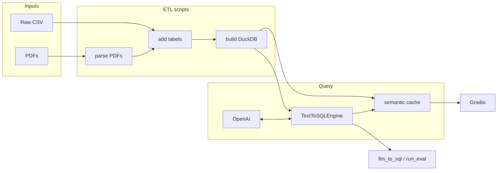

# Codebase.md — Layout and responsibilities

Monolith pipeline: scripts and notebooks produce data and DuckDB; [`src/text_sql/`](../src/text_sql/) implements NL→SQL plus the semantic query cache; [`apps/`](../apps/) is the Gradio UI. No separate API service.

## Repository directories

| Directory | What it is for |
|-----------|----------------|
| [`data/`](../data/) | Raw and derived CSVs, PDFs, lookup tables, benchmark questions (often gitignored locally; must be provisioned). |
| [`configs/`](../configs/) | Versioned defaults: engine YAML, system prompt markdown, Gradio UI copy, sample queries, intent-classification prompt. |
| [`scripts/`](../scripts/) | CLI stages: PDF → lookups, label CSV, build DuckDB, batch LLM→SQL, build semantic index, run eval. |
| [`src/`](../src/) | Importable code: [`text_sql/`](../src/text_sql/) (NL→SQL) and [`utils/`](../src/utils/) (WHO labeling + small CSV helpers). |
| [`database/`](../database/) | DuckDB file(s) from `build_nutrition_db.py`; semantic cache under `semantic_query_cache/` (usually gitignored). |
| [`apps/`](../apps/) | Gradio entrypoint, UI config, result formatting and rephrase helpers. |
| [`notebooks/`](../notebooks/) | Interactive EDA, cleaning, and DB validation. |
| [`docs/`](../docs/) | Design and status notes (this file, `Eval.md`, `ProjectStatus.md`, etc.). |
| [`outputs/`](../outputs/) | JSON traces from CLI/UI runs and eval reports (gitignored). |

## `src/text_sql/` — text-to-SQL stack

The engine runs **schema grounding → prompt → LLM → extract SQL → execute (read-only) → optional repair**. Public exports live in [`__init__.py`](../src/text_sql/__init__.py).

### Subpackages (by function)

| Path | Function |
|------|----------|
| [`utils/`](../src/text_sql/utils/) | Load [`configs/nutrition_text_to_sql.yaml`](../configs/nutrition_text_to_sql.yaml), merge env overrides, build the system prompt from template + DuckDB schema/samples, read query files, save trace JSON. |
| [`engine/`](../src/text_sql/engine/) | `TextToSQLEngine`: builds the prompt once at init, then runs the NL→SQL loop per question (including one repair attempt). |
| [`adapters/`](../src/text_sql/adapters/) | `LangChainOpenAIChatClient` — OpenAI chat via LangChain with token tracking. |
| [`sql/`](../src/text_sql/sql/) | Extract SQL from model text; read-only execution via LangChain `SQLDatabase`; optional direct DuckDB → DataFrame for the UI. |
| [`results/`](../src/text_sql/results/) | Parse stringified query results for display, rephrase, and eval comparison. |
| [`eval/`](../src/text_sql/eval/) | Parse verified benchmark SQL, compare executed results to golden outputs, aggregate metrics. See [`Eval.md`](Eval.md). |
| [`semantic_cache/`](../src/text_sql/semantic_cache/) | FAISS-backed lookup over previously answered questions (`embedding_index.faiss` + `indexed_queries.jsonl`). Used by Gradio only, not by eval. |

### Pipeline flow (one question)

1. **Init** — `TextToSQLEngine.from_config(db_path, top_k)` loads YAML settings, fetches table DDL + sample rows from DuckDB, and fills `configs/prompts/nutrition_system.md` placeholders (`__TABLE_INFO__`, `__SAMPLE_ROWS__`, `__TOP_K__`).
2. **Question** — append `User question:\n{question}` and call the LLM.
3. **Extract** — `extract_sql()` pulls the first `SELECT`/`WITH` from the response.
4. **Execute** — `execute_sql()` runs against DuckDB; non-read-only SQL is blocked.
5. **Repair** — if execution fails and `repair_enabled` in YAML, a second LLM call fixes the SQL and re-executes.

Model and temperature come from YAML / env (`MODEL_NAME`, `TEMPERATURE`), not from per-call CLI overrides.

## `src/utils/` — labeling and small helpers

| Path | Function |
|------|----------|
| [`nutrition_labels.py`](../src/utils/nutrition_labels.py) | WHO-style thresholds from lookup CSVs; `classify_all(...)` for stunting / underweight / wasting / SAM. |
| [`csv_utils.py`](../src/utils/csv_utils.py) | `load_csv` / `summarize` for notebooks. |

## Main scripts

| Script | Role |
|--------|------|
| `parse_assessment_pdfs.py` | PDF text → processed lookup CSVs. |
| `add_nutrition_labels.py` | Cleaned CSV + lookups → labeled CSV. |
| `build_nutrition_db.py` | Labeled CSV → DuckDB table `nutrition_data`. |
| `llm_to_sql.py` | NL questions → generated SQL and JSON traces. |
| `build_semantic_query_index.py` | Run the engine on seed questions; write FAISS index + JSONL corpus for Gradio cache. |
| `run_eval.py` | Full benchmark eval against golden SQL; writes report to `outputs/eval_reports/`. |

## DuckDB model (summary)

Single wide table **`nutrition_data`**: one row per child (`beneficiary_id`); admin columns including `district_name`; month prefixes `feb24_`, `mar24_`, `apr24_` for measurements and derived label columns (`*_status`, `*_is_*`).

## Semantic query cache (Gradio)

Optional shortcut before the LLM path: embed the user's question, FAISS top-1 search against indexed past questions, return cached SQL/results if similarity ≥ threshold (default 0.95).

- **Build:** `scripts/build_semantic_query_index.py` → `database/semantic_query_cache/`
- **Runtime:** `apps/gradio_app.py` loads the index when enabled
- **Config:** `apps/config.py` / `.env` — enabled by default (`SEMANTIC_QUERY_CACHE_ENABLED=true`), directory `database/semantic_query_cache`

Eval and `llm_to_sql.py` always call the engine directly; they do not use the cache.

## Stack (essentials)

Python 3.10+, DuckDB, pandas, LangChain + `langchain-openai`, `duckdb-engine`, Gradio, PyYAML, `python-dotenv`, NumPy, FAISS CPU, `sentence-transformers`. Secrets: `OPENAI_API_KEY` in `.env`.

## Run Gradio

```bash
python apps/gradio_app.py
```

Build cache artifacts first if not present:

```bash
python scripts/build_semantic_query_index.py \
  --queries-file data/queries/queries.txt \
  --database database/nutrition_data_filtered.duckdb
```

## Pipeline overview


