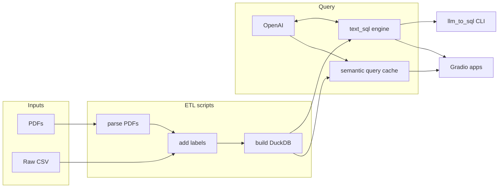

# Codebase.md — Layout and responsibilities

Monolith pipeline: scripts and notebooks produce data and DuckDB; [`src/text_sql/`](../src/text_sql/) implements NL→SQL plus the semantic query cache; [`apps/`](../apps/) is the Gradio UI. No separate API service.

## Repository directories

| Directory | What it is for |
|-----------|----------------|
| [`data/`](../data/) | Raw and derived CSVs, PDFs, lookup tables, benchmark questions (often gitignored locally; must be provisioned). |
| [`configs/`](../configs/) | Versioned defaults: engine YAML, prompt markdown, Gradio UI copy, sample queries, and intent-classification prompt. |
| [`scripts/`](../scripts/) | CLI stages: PDF → lookups, label CSV, build DuckDB, batch LLM→SQL, build semantic query index. |
| [`src/`](../src/) | Importable code: [`text_sql/`](../src/text_sql/) (NL→SQL) and [`utils/`](../src/utils/) (WHO labeling + small CSV helpers). |
| [`database/`](../database/) | DuckDB file(s) produced by `build_nutrition_db.py`; semantic cache artifacts under `semantic_query_cache/`; artifacts usually gitignored. |
| [`apps/`](../apps/) | Gradio entrypoint, UI config loader, result formatting and rephrase helpers. |
| [`notebooks/`](../notebooks/) | Interactive EDA, cleaning, and DB validation. |
| [`docs/`](../docs/) | Design and status notes (this file, `ProjectStatus.md`, etc.). |
| [`outputs/`](../outputs/) | JSON traces from CLI/UI runs (gitignored). |

## `src/text_sql/` — text-to-SQL stack

The engine wires **grounding → prompt → LLM → extract SQL → execute (read-only) → optional repair**. Public entry points live on [`service/`](../src/text_sql/service/) and are re-exported from [`__init__.py`](../src/text_sql/__init__.py).

### Subpackages (by function)

| Path | Function |
|------|----------|
| [`config/`](../src/text_sql/config/) | Load [`configs/nutrition_text_to_sql.yaml`](../configs/nutrition_text_to_sql.yaml); merge env overrides; expose `NutriSqlSettings` and path helpers. |
| [`grounding/`](../src/text_sql/grounding/) | Build cached DuckDB table DDL + a few sample rows for the system prompt (ICL). |
| [`sql/`](../src/text_sql/sql/) | Parse SQL from model text; enforce read-only execution via LangChain `SQLDatabase`; optional direct DuckDB → DataFrame for the UI. |
| [`results/`](../src/text_sql/results/) | Parse stringified query results for display and for downstream LLM rephrase. |
| [`eval/`](../src/text_sql/eval/) | Parse verified benchmark SQL and compare executed results to golden outputs. |
| [`engine/`](../src/text_sql/engine/) | `TextToSQLEngine`: orchestrates the full NL→SQL loop including one repair attempt. |
| [`service/`](../src/text_sql/service/) | Stable façade: `run_single_question`, `warmup_runtime`, trace JSON I/O, `read_queries_file`. |
| [`prompts/`](../src/text_sql/prompts/) | Re-exports prompt-builder types (thin namespace over adapters). |
| [`llm/`](../src/text_sql/llm/) | Re-exports chat-client helpers (thin namespace over adapters). |
| [`semantic_cache/`](../src/text_sql/semantic_cache/) | FAISS-backed semantic lookup over previously answered questions; stores vectors in `embedding_index.faiss` and aligned `IndexedQuery` records in `indexed_queries.jsonl`. |

### What `adapters/` means

**Adapters** are the [adapter pattern](https://en.wikipedia.org/wiki/Adapter_pattern): small **interfaces (ABCs)** for “schema context”, “prompt builder”, “LLM”, and “SQL executor”, plus **concrete classes** that plug in **LangChain + OpenAI + DuckDB** today. The engine depends on those interfaces, not on Gradio or script CLIs, so you could swap implementations (e.g. another model client or executor) without rewriting the pipeline. Code lives in [`adapters/providers.py`](../src/text_sql/adapters/providers.py).

## `src/utils/` — labeling and small helpers

| Path | Function |
|------|----------|
| [`nutrition_labels.py`](../src/utils/nutrition_labels.py) | WHO-style thresholds from lookup CSVs; `classify_all(...)` for stunting / underweight / wasting / SAM. |
| [`csv_utils.py`](../src/utils/csv_utils.py) | `load_csv` / `summarize` for notebooks (optional; also re-exported from [`__init__.py`](../src/utils/__init__.py)). |

Import examples: `from src.utils.nutrition_labels import classify_all` or `from src.utils import classify_all`.

## Main scripts (order of pipeline)

| Script | Role |
|--------|------|
| `parse_assessment_pdfs.py` | PDF text → processed lookup CSVs. |
| `add_nutrition_labels.py` | Cleaned CSV + lookups → labeled CSV (uses `src.utils.nutrition_labels`). |
| `build_nutrition_db.py` | Labeled CSV → DuckDB table `nutrition_data`. |
| `llm_to_sql.py` | NL questions → generated SQL and traces; optional `--config` for YAML path. |
| `build_semantic_query_index.py` | Batch-generate cached query answers and build FAISS + JSONL semantic query artifacts. |

## DuckDB model (summary)

Single wide table **`nutrition_data`**: one row per child (`beneficiary_id`); admin columns including `district_name`; three month prefixes `feb24_`, `mar24_`, `apr24_` for measurements and derived label columns (`*_status`, `*_is_*`). Schema comes from the CSV load, not checked-in DDL.

## Stack (essentials)

Python 3.10+, DuckDB, pandas, LangChain + `langchain-openai`, `duckdb-engine` + SQLAlchemy &lt; 2, Gradio, PyPDF2, PyYAML, `python-dotenv`, NumPy, FAISS CPU, `sentence-transformers`. Secrets: `OPENAI_API_KEY` in `.env`.

## Run Gradio

From the repository root, with `OPENAI_API_KEY` and a DuckDB in place (see [`README.md`](../README.md)):

```bash
python apps/gradio_app.py
```

To enable semantic query caching in Gradio, first build the local artifacts:

```bash
python scripts/build_semantic_query_index.py \
  --queries-file data/queries/queries.txt \
  --database database/nutrition_data_filtered.duckdb \
  --output-directory database/semantic_query_cache

export SEMANTIC_QUERY_CACHE_ENABLED=true
export SEMANTIC_QUERY_CACHE_DIRECTORY=database/semantic_query_cache
python apps/gradio_app.py
```

## Pipeline overview


