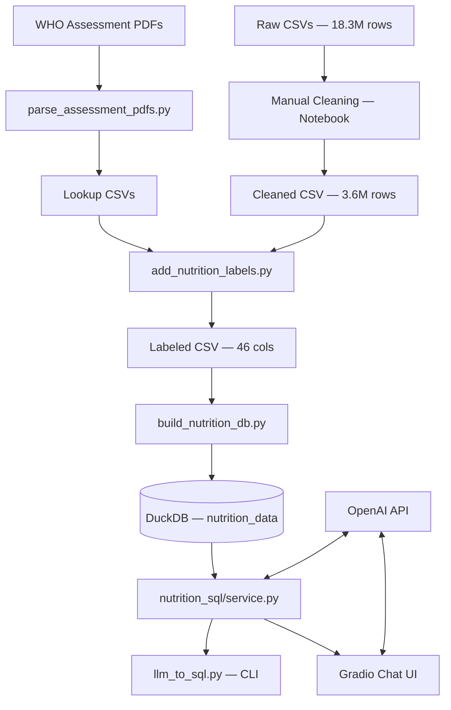
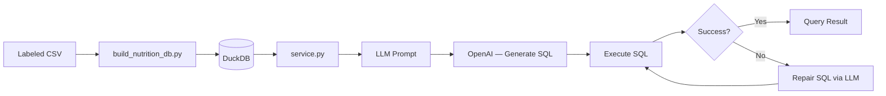

# Codebase.md — Structural Design

## 1. High-Level Architecture

**Pattern: Modular Monolith (Script-Orchestrated Data Pipeline)**

The codebase follows a **pipeline-oriented monolith** architecture. There is no service mesh, no API gateway, and no microservice boundary. Instead, a chain of standalone Python scripts transforms raw data through successive stages, culminating in an embedded analytics database queried via an LLM-powered UI.

```
┌─────────────────────────────────────────────────────────────────────┐
│                         Repository Layout                           │
│                                                                     │
│  data/          Static assets: raw CSVs, PDF-derived lookups        │
│  scripts/       Sequential ETL scripts (parse → label → build → Q) │
│  src/           Reusable library code (labels engine, SQL service)  │
│  database/      Runtime artifact: DuckDB file (gitignored)          │
│  apps/          Gradio web UI (single entry point)                  │
│  notebooks/     Exploratory analysis (EDA, validation)              │
│  docs/          Project documentation                               │
│  outputs/       LLM trace artifacts (gitignored)                    │
└─────────────────────────────────────────────────────────────────────┘
```

Key architectural traits:

| Trait | Description |
|-------|-------------|
| **Embedded DB** | DuckDB (single file, no server process) serves as the analytics store. |
| **LLM-in-the-loop** | OpenAI models generate SQL at runtime; a repair loop retries on failure. |
| **No service layer** | No REST/gRPC API between components; Gradio calls `src/` functions directly. |
| **No container/CI** | No Dockerfile, docker-compose, Makefile, or CI/CD pipeline configuration. |
| **Script orchestration** | Pipeline stages are run manually via `python scripts/*.py` in sequence. |

---

## 2. Component Breakdown

### 2.1 `data/` — Static Data Assets

| Subdirectory / File | Responsibility |
|----------------------|----------------|
| `3_months_UP_0m_6y_data*.csv` | Raw ICDS-style child health extracts for Uttar Pradesh (0–6y, Feb–Apr 2024). ~18.3M rows, 23–29 columns. |
| `cleaned_dataset.csv` | Post-cleaning subset (~3.64M rows): Hb columns dropped, null birth metrics filtered. |
| `cleaned_dataset_with_labels.csv` | Analytics-ready table with 24 additional nutrition label columns. |
| `cleaned_dataset_with_labels_filtered.csv` | Stricter-filtered labeled subset (~3.45M rows). |
| `district_mapping.csv` | Reference: `district_name` ↔ `district_id` for 75 UP districts. |
| `processed/stunting_lookup.csv` | Height-for-age thresholds by (sex, day). 4,444 rows. |
| `processed/underweight_lookup.csv` | Weight-for-age thresholds by (sex, day). 4,444 rows. |
| `processed/wasting_lookup.csv` | Weight-for-height thresholds by (sex, age_band, height_cm). 1,300 rows. |
| `queries/queries.txt` | 28 natural-language benchmark questions. |
| `queries/queries_verified.sql` | Reference SQL + expected results for benchmarking. |

**Interaction:** `data/` is read by `scripts/` and `src/nutrition_labels.py`. It is gitignored (broad `data/` rule), so these files must be provisioned locally.

### 2.2 `scripts/` — ETL Pipeline Scripts

| Script | Stage | Input | Output |
|--------|-------|-------|--------|
| `parse_assessment_pdfs.py` | 1 | `data/*.pdf` (3 WHO-style PDFs) | `data/processed/*_lookup.csv` |
| `add_nutrition_labels.py` | 2 | `data/cleaned_dataset.csv` + lookups | `data/cleaned_dataset_with_labels.csv` |
| `build_nutrition_db.py` | 3 | Labeled CSV | `database/*.duckdb` (Gradio default: `nutrition_data_filtered.duckdb`) |
| `llm_to_sql.py` | 4 | DuckDB + NL question(s) | Console output + `outputs/*.json` |

**Interaction:** Scripts are stateless CLI tools. Each reads its predecessor's output. `add_nutrition_labels.py` imports from `src/nutrition_labels`. `llm_to_sql.py` imports from `src/nutrition_sql/service`.

### 2.3 `src/` — Core Library

```
src/
├── __init__.py               # Empty package marker
├── utils.py                  # CSV load/summarize helpers (currently unused)
├── nutrition_labels.py       # WHO-style classification engine
└── nutrition_sql/
    ├── __init__.py           # Re-exports public API
    └── service.py            # LLM→SQL generation, execution, repair, comparison
```

| Module | Responsibility |
|--------|----------------|
| `nutrition_labels.py` | Loads `data/processed/*_lookup.csv` into lazy-cached dicts. Exposes `classify_all(sex, age_days, height_cm, weight_kg) → dict` for stunting/underweight/wasting/SAM status. |
| `nutrition_sql/service.py` | Manages the full NL→SQL lifecycle: prompt construction from DuckDB schema, LLM invocation via LangChain `ChatOpenAI`, SQL extraction/normalization, read-only enforcement, execution via `SQLDatabase`, one-shot SQL repair on failure, and verified-SQL comparison for benchmarking. |
| `utils.py` | Thin `pandas` wrappers (`load_csv`, `summarize`). Not imported by any other module — effectively dead code. |

**Internal coupling:** Zero. `nutrition_labels` and `nutrition_sql` do not import each other. Orchestration happens in `scripts/` and `apps/`.

### 2.4 `database/` — DuckDB Runtime Store

Contains only a `.gitkeep` placeholder. DuckDB files (for example `nutrition_data_filtered.duckdb`, the Gradio default) are generated by `build_nutrition_db.py` and gitignored. The DB holds a single wide table (`nutrition_data`) with ~46 columns and ~3.4M rows in the filtered export.

### 2.5 `apps/` — Gradio Web Interface

Single file: `gradio_app.py` (586 lines). Builds a **Gradio Blocks** chat-first UI:

| UI Element | Function |
|------------|----------|
| `ChatInterface` | Accepts NL questions, calls `run_single_question()` from `src/nutrition_sql/service`. |
| Results tab | Displays `gr.Dataframe` + `gr.Markdown` summary of SQL results. |
| Ground truth section | Renders parsed Q&A from `queries_verified.sql` as a reference table. |
| LLM rephrase | Uses a secondary `ChatOpenAI` (`gpt-4o-mini`) to rephrase raw SQL results into natural language. |

**Interaction:** Imports `run_single_question`, `save_single_trace`, `warmup_runtime` from `src.nutrition_sql.service`. Connects to DuckDB at `DB_PATH` (default: `database/nutrition_data_filtered.duckdb`).

### 2.6 `notebooks/` — Exploratory Analysis

| Notebook | Purpose | Connects to |
|----------|---------|-------------|
| `01_initial_exploration.ipynb` | Heavy EDA on raw CSV: chunked profiling, missingness, cleaning, label generation. | `data/`, `src/nutrition_labels` |
| `01_explore.ipynb` | Schema inspection of normalized DuckDB (`child_health.duckdb` — legacy). | `database/` |
| `eda_processed_database.ipynb` | Validation of processed DuckDB (`nutrition_data_filtered.duckdb`). | `database/` |

### 2.7 Component Interaction Diagram



---

## 3. Data Schema

### 3.1 Database Engine

**DuckDB** (embedded, serverless, single-file). Connected via:
- Direct: `duckdb.connect(str(db_path))`
- LangChain: `SQLDatabase.from_uri("duckdb:///{db_path}")`

### 3.2 Table: `nutrition_data`

A single denormalized wide table. Schema is inferred at load time via `CREATE TABLE AS SELECT * FROM <registered DataFrame>`. No explicit DDL, constraints, indices, views, or stored procedures.

#### Column Groups

| Group | Columns | Type | Notes |
|-------|---------|------|-------|
| **Identity** | `beneficiary_id` | VARCHAR/INT | Row-level grain: one row per child |
| **Demographics** | `dob`, `gender` | DATE/VARCHAR | Date of birth, M/F |
| **Birth metrics** | `birth_height`, `birth_weight` | FLOAT | Non-null filter applied during cleaning |
| **Admin hierarchy** | `state_id`, `district_name`, `project_id`, `sector_id`, `awc_id`, `awc_code` | INT/VARCHAR | `district_name` in the Gradio default DB (`nutrition_data_filtered.duckdb`); CSV→DuckDB builds may start with `district_id` until mapped |
| **Monthly measurements** (×3) | `{month}_status`, `{month}_height`, `{month}_weight`, `{month}_height_weight_entered_date` | VARCHAR/FLOAT/DATE | For `feb24`, `mar24`, `apr24` |
| **Monthly labels** (×3) | `{month}_stunting_status`, `{month}_is_stunted`, `{month}_underweight_status`, `{month}_is_underweight`, `{month}_wasting_status`, `{month}_is_wasted`, `{month}_is_sam` | VARCHAR/INT(0/1) | WHO-derived classification labels |

**Total columns:** ~46 (22 base + 24 label columns).
**Total rows:** ~3.6M (full `cleaned_dataset_with_labels.csv`); ~3.45M in `nutrition_data_filtered.duckdb`.

### 3.3 Data Flow: Database Layer → src/ Logic



Key points:
- Schema introspection (`get_table_info`) happens once at startup and is `@lru_cache`d.
- Sample rows (3 rows) are embedded in every LLM prompt for grounding.
- Bool-like label columns (`*_is_*`) are normalized to `0`/`1` integers during DB build for clean aggregation.

---

## 4. Technical Stack

### 4.1 Core Languages & Runtime

| Technology | Version Constraint | Role |
|------------|--------------------|------|
| Python | 3.10+ (union type hints used) | All code |
| DuckDB | ≥ 0.9.0 | Embedded analytics database |
| pandas | ≥ 2.0.0 | Data loading, transformation, display |

### 4.2 LLM / AI Stack

| Technology | Version Constraint | Role |
|------------|--------------------|------|
| OpenAI API | via `langchain-openai ≥ 1.1.0` | SQL generation (`gpt-5-mini`), result rephrasing (`gpt-4o-mini`) |
| LangChain | ≥ 1.0.0 | LLM orchestration, `SQLDatabase` wrapper |
| LangChain Community | ≥ 0.4.0 | `SQLDatabase` utility |

### 4.3 Web / UI

| Technology | Version Constraint | Role |
|------------|--------------------|------|
| Gradio | ≥ 5.0.0 | Chat UI with `Blocks`, `ChatInterface`, `Dataframe` |

### 4.4 Data Processing

| Technology | Version Constraint | Role |
|------------|--------------------|------|
| PyPDF2 | ≥ 3.0.0 | PDF text extraction for lookup tables |
| SQLAlchemy | < 2 | Required by `duckdb-engine` for LangChain `SQLDatabase` |
| duckdb-engine | ≥ 0.17.0 | SQLAlchemy dialect for DuckDB |
| python-dotenv | ≥ 1.0.0 | `.env` file loading |

### 4.5 Unlisted but Used

| Package | Used By | Notes |
|---------|---------|-------|
| `tqdm` | `add_nutrition_labels.py`, `01_initial_exploration.ipynb` | Progress bars; **missing from `requirements.txt`** |
| `matplotlib`, `seaborn` | `01_initial_exploration.ipynb` | Notebook-only visualization |
| `numpy` | `01_initial_exploration.ipynb` | Notebook-only |

### 4.6 External Services

| Service | Authentication | Usage |
|---------|---------------|-------|
| **OpenAI API** | `OPENAI_API_KEY` in `.env` | SQL generation and natural-language result rephrasing |

---

## 5. Inconsistencies & Deviations from Best Practices

| # | Issue | Severity | Detail |
|---|-------|----------|--------|
| 1 | **No tests** | High | Zero unit/integration/e2e tests anywhere in the repo. No `tests/` directory, no pytest config. |
| 2 | **No CI/CD** | High | No GitHub Actions, GitLab CI, or any automation pipeline. |
| 3 | **No containerization** | Medium | No Dockerfile or docker-compose. Deployment relies on manual conda/pip setup. |
| 4 | **No formal packaging** | Medium | No `pyproject.toml` or `setup.py`. The project cannot be `pip install`ed. `sys.path` hacks are used instead. |
| 5 | **Broad `.gitignore`** | Medium | `data/` and `database/` are fully gitignored. Essential reference files (lookups, mapping, queries) are excluded from version control. |
| 6 | **Missing dependency** | Low | `tqdm` is used but not listed in `requirements.txt`. |
| 7 | **Dead code** | Low | `src/utils.py` is not imported anywhere. `prefer_verified_templates` parameter is a documented no-op. |
| 8 | **Space in directory name** | Low | `data/queries /` contains a trailing space — fragile on some filesystems and shells. |
| 9 | **No logging** | Medium | All output is via `print()`. No structured logging framework. |
| 10 | **Global mutable state** | Low | `nutrition_labels.py` uses module-level mutable globals for lazy caching instead of a proper cache or singleton pattern. |
| 11 | **Schema drift risk** | Medium | DB schema is inferred from CSV at build time (`CREATE TABLE AS SELECT *`). No explicit DDL or migration history. |
| 12 | **Doc vs. code mismatch** | Low | `docs/PROJECT.md` describes a normalized multi-table design that was never implemented. Only the flat `nutrition_data` table exists. |
