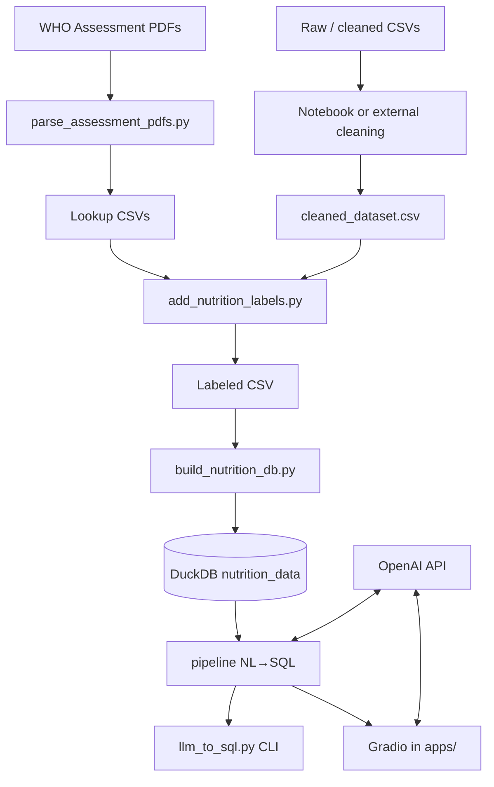
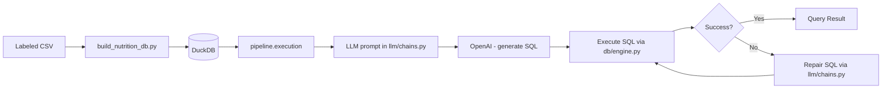

# Codebase.md — Structural Design

This document explains **where code lives** and **what each part does**. If you are new to the repo, read [§ Quick tour](#quick-tour-for-beginners) first, then skim the folder table and the `pipeline/` library breakdown.

---

## Quick tour for beginners

**What this project does (one sentence):** It turns child nutrition records into a DuckDB database, then answers **natural-language questions** by having an LLM write **read-only SQL** against that database (CLI or Gradio UI).

**Typical flow:**

1. **Data & ETL** — Raw/cleaned CSVs and PDF-derived lookups live under `data/`. Scripts in `scripts/` run in order: parse PDFs → add labels → build the DuckDB file.
2. **Shared logic** — Reusable Python lives under `pipeline/`: nutrition classification (`nutrition_labels.py`) and the NL→SQL stack (`service.py`, `db/`, `llm/`, etc.).
3. **Apps** — `apps/` is the **web UI** (Gradio). It imports `pipeline/`; there is no separate backend server.
4. **Queries** — You can run `scripts/llm_to_sql.py` from the terminal or launch `apps/gradio_app.py` for chat.

**Mental model:**

| You want to… | Look here |
|----------------|-----------|
| Change how CSVs become the database | `scripts/build_nutrition_db.py`, `data/` |
| Change WHO-style stunting/wasting rules | `pipeline/nutrition_labels.py`, `data/processed/*_lookup.csv` |
| Change SQL generation prompts or LLM wiring | `pipeline/llm/chains.py`, `pipeline/db/engine.py` |
| Change the chat UI | `apps/gradio_app.py`, `conf/gradio/`, `apps/ui_content.py`, `apps/result_utils.py` |
| Run batch benchmark queries | `scripts/llm_to_sql.py`, `outputs/` |
| Understand table/column meanings | [§ Data Schema](#3-data-schema) below |

**Why ETL steps use `scripts/` but shared rules use `pipeline/`** (even though both are pre-processing and end up in the DB): see **§2.2.1** under [Component Breakdown](#2-component-breakdown).

---

## 1. High-Level Architecture

**Pattern: Modular Monolith (Script-Orchestrated Data Pipeline)**

The codebase follows a **pipeline-oriented monolith** architecture. There is no service mesh, no API gateway, and no microservice boundary. Instead, a chain of standalone Python scripts transforms raw data through successive stages, culminating in an embedded analytics database queried via an LLM-powered UI.

```
┌─────────────────────────────────────────────────────────────────────┐
│                         Repository Layout                           │
│                                                                     │
│  data/          Static assets: raw CSVs, PDF-derived lookups        │
│  scripts/       Sequential ETL scripts (parse → label → build → Q)  │
│  pipeline/      Reusable library (labels + NL→SQL query stack)      │
│  database/      Runtime artifact: DuckDB file (often gitignored)    │
│  apps/          Gradio web UI + result formatting                   │
│  conf/          Hydra YAML (paths, LLM, rephrase, Gradio defaults)   │
│  notebooks/     Exploratory analysis (EDA, validation)              │
│  docs/          Project documentation (this file, etc.)           │
│  tests/         Pytest unit tests (pure helpers, no live API/DB)    │
│  outputs/       LLM trace JSON (often gitignored)                     │
└─────────────────────────────────────────────────────────────────────┘
```

Key architectural traits:

| Trait | Description |
|-------|-------------|
| **Embedded DB** | DuckDB (single file, no server process) serves as the analytics store. |
| **LLM-in-the-loop** | OpenAI models generate SQL at runtime; a repair step retries on execution failure. |
| **No HTTP service layer** | No REST/gRPC API between components; Gradio calls `pipeline/` functions in-process. |
| **Script orchestration** | Pipeline stages are run manually via `python scripts/<name>.py` in sequence. |

---

## 2. Component Breakdown

### 2.1 `data/` — Static Data Assets

| Subdirectory / File | Responsibility |
|---------------------|----------------|
| `3_months_UP_0m_6y_data*.csv` | Raw ICDS-style child health extracts for Uttar Pradesh (0–6y, Feb–Apr 2024). Large row counts. |
| `cleaned_dataset.csv` | Post-cleaning subset used as input to labeling. |
| `cleaned_dataset_with_labels.csv` | Analytics-ready table with extra nutrition label columns. |
| `cleaned_dataset_with_labels_filtered.csv` | Optional stricter-filtered labeled subset. |
| `district_mapping.csv` | Reference: `district_name` ↔ `district_id` for UP districts. |
| `processed/stunting_lookup.csv` | Height-for-age thresholds by (sex, day). |
| `processed/underweight_lookup.csv` | Weight-for-age thresholds by (sex, day). |
| `processed/wasting_lookup.csv` | Weight-for-height thresholds by (sex, age_band, height_cm). |
| `queries /queries.txt` | Benchmark questions (note: folder name has a **trailing space** — `queries `). |
| `queries /queries_verified.sql` | Reference SQL + commented results for benchmarking. |

**Interaction:** `data/` is read by `scripts/` and `pipeline/nutrition_labels.py`. Much of `data/` may be gitignored locally; files often must be provisioned on each machine.

### 2.2 `scripts/` — ETL Pipeline Scripts

| Script | Stage | Input | Output |
|--------|-------|-------|--------|
| `parse_assessment_pdfs.py` | 1 | `data/*.pdf` (WHO-style assessment PDFs) | `data/processed/*_lookup.csv` |
| `add_nutrition_labels.py` | 2 | `cleaned_dataset.csv` + lookups | `cleaned_dataset_with_labels.csv` |
| `build_nutrition_db.py` | 3 | Labeled CSV | `database/nutrition_data.duckdb` |
| `llm_to_sql.py` | 4 | DuckDB + NL question(s) | Console output + `outputs/*.json` (batch mode) |

**Interaction:** Scripts are stateless CLI tools. Each reads its predecessor’s output where applicable. `add_nutrition_labels.py` imports `pipeline.nutrition_labels`. `llm_to_sql.py` imports `pipeline.service`.

### 2.2.1 Design note: why ETL scripts live in `scripts/` but WHO-style logic lives in `pipeline/`

It can look odd that **CSV-writing steps** sit under `scripts/` while **stunting / underweight / wasting math** sits under `pipeline/nutrition_labels.py`, when **all of that is pre-processing** and ends up **baked into** the DuckDB file via `build_nutrition_db.py`. The split is intentional:

| | **`scripts/`** | **`pipeline/`** |
|---|------------------|----------------|
| **Role** | **Pipeline drivers** — runnable stages you execute from the shell: which files to read/write, chunk size, progress, CLI flags, and wiring. | **Reusable library** — **what** the computation means: classification against lookup tables, SQL/LLM behavior, anything you might import from a notebook or test. |
| **Analogy** | The **job** (“read this CSV, add columns, save there”). | The **rules** (“given sex, age, height, weight, return these labels”). |

**Why not put everything in `scripts/`?** You could inline the WHO-style logic inside `add_nutrition_labels.py`, but then notebooks, experiments, and tests would either duplicate code or import a script module awkwardly. Keeping **`classify_all` / `classify_stunting`** in `pipeline/` means one canonical definition of labels, reused by the labeling script and by exploratory work.

**Why not put scripts in `pipeline/`?** Scripts are **thin orchestration**: they are not imported as stable APIs; they tie together paths, I/O, and library calls. The NL→SQL stack under **`pipeline/`** follows the same idea: **`execution/runner.py`** runs the flow; **`llm/chains.py`** holds prompts and model chains.

**End state:** Yes — once the labeled CSV exists and `build_nutrition_db.py` runs, the **database** holds the result. The **labeling** code is not needed at **query time** for nutrition labels (only the LLM stack is). The split matters while **building** and **validating** the dataset, not because the runtime DB “knows” where the code lived.

### 2.3 `pipeline/` — Core Library

```
pipeline/
├── __init__.py
├── nutrition_labels.py      # WHO-style classification (stunting, underweight, wasting, SAM)
├── paths.py                 # Canonical paths + resolve_config_path for Hydra entry points
├── service.py               # Facade: load_dotenv + stable re-exports for NL→SQL
├── sql/                     # SQL text: guards, extraction, normalization
│   └── text.py
├── db/                      # LangChain SQLDatabase, caches, execute_sql, warmup
│   └── engine.py
├── llm/                     # Prompts + LangChain chains (generate / repair SQL)
│   └── chains.py
├── execution/               # run_single_question, dataframe helper, trace I/O
│   ├── runner.py
│   └── traces.py
└── benchmark/               # Verified-SQL file parsing + benchmark comparison
    └── verification.py
```

#### What each NL→SQL submodule is for

| Path | Beginner-friendly role |
|------|-------------------------|
| **`paths.py`** | Canonical paths (e.g. verified SQL / queries dir) and `resolve_config_path()` for repo-relative paths when using Hydra. YAML under `conf/` remains the source of truth for defaults. |
| **`sql/text.py`** | **Safety + parsing:** ensures only `SELECT`/`WITH`, pulls SQL out of markdown fences, normalizes SQL strings when comparing to “verified” benchmark SQL. |
| **`db/engine.py`** | **Database + execution:** opens DuckDB through LangChain’s `SQLDatabase`, caches schema/sample rows for prompts, caches `ChatOpenAI` clients, runs SQL and parses string results for the UI/benchmarks. |
| **`llm/chains.py`** | **Prompts + model calls:** builds the large system prompt from schema + sample rows; runs LangChain `ChatPromptTemplate` chains for “question → SQL” and “broken SQL → fix”. |
| **`execution/runner.py`** | **Main user journey:** `run_single_question` ties LLM → execute → optional repair. |
| **`execution/traces.py`** | Saves JSON traces and reads query list files for batch mode. |
| **`benchmark/verification.py`** | **Benchmarking only:** reads `queries_verified.sql`, runs reference SQL, compares outputs to generated SQL results. |
| **`service.py`** | **Stable entrypoint:** `load_dotenv()` and re-exports; use `from pipeline.service import …`. |

| Module | Responsibility |
|--------|----------------|
| `nutrition_labels.py` | Loads `data/processed/*_lookup.csv` (cached). Exposes `classify_all(...)` for stunting / underweight / wasting / SAM for one measurement. |

**Internal coupling:** `nutrition_labels` and the NL→SQL modules do not import each other. Orchestration happens in `scripts/` and `apps/`.

### 2.4 `database/` — DuckDB Runtime Store

Usually contains a `.gitkeep`; the real `nutrition_data.duckdb` is produced by `build_nutrition_db.py` and is often gitignored. The DB holds a single wide table (`nutrition_data`) with monthly columns and label fields.

### 2.5 `conf/` — Hydra configuration

| Path | Role |
|------|------|
| **`config.yaml`** | Composes defaults: `paths`, `llm`, `rephrase`, `gradio`; sets `hydra.job.chdir: false` so repo-relative paths behave like plain scripts. |
| **`paths/default.yaml`** | DuckDB path, verified SQL file, trace output dir (`${oc.env:...}` for `DB_PATH`, `VERIFIED_SQL_PATH`, `OUTPUT_DIR`). |
| **`llm/default.yaml`** | SQL model name, temperature, `top_k`, and optional `client` `_target_` for `ChatOpenAI` (used by entry points via `hydra.utils.instantiate`). |
| **`rephrase/default.yaml`** | Small chat model settings for answer rephrasing in the UI. |
| **`gradio/default.yaml`** | Queue sizes, trace/history flags, server host/port defaults. |

**Overrides:** `python apps/gradio_app.py gradio.server_port=8080` or `python scripts/llm_to_sql.py llm.model=gpt-4o-mini "Your question?"`. Legacy flags on `llm_to_sql.py` (`--db`, `--model`, …) map to the same keys.

**Interaction:** `apps/gradio_app.py` uses `@hydra.main`; `scripts/llm_to_sql.py` uses `hydra.compose` after splitting Hydra overrides from argparse. Env vars such as `MODEL_NAME`, `TEMPERATURE`, `GRADIO_SERVER_PORT` still override after compose (same behavior as before).

### 2.6 `apps/` — Gradio Web Interface

| File | Role |
|------|------|
| **`gradio_app.py`** | Entry point (`@hydra.main`): chat UI, calls `run_single_question` with an instantiated `ChatOpenAI`, optional trace save, side panel for results and ground truth. |
| **`config.py`** | Minimal: project `ROOT`, `sys.path`, `load_dotenv()`, and optional path shims (`DEFAULT_DB_PATH`, …) for back-compat imports. |
| **`ui_content.py`** | Static tips markdown, sample queries/labels, and `APP_CSS` (not Hydra-driven). |
| **`result_utils.py`** | Formats SQL results as tables/markdown, loads ground-truth HTML from verified SQL file, **rephrases** numeric/tabular results with a small LangChain chat model (parameters from Hydra + env). |

**Interaction:** Imports `run_single_question`, `save_single_trace`, `warmup_runtime` from `pipeline.service`. Default DB path comes from `conf/paths` and `DB_PATH` env.

### 2.7 `tests/` — Automated tests

| File | Role |
|------|------|
| `test_nutrition_sql_pure.py` | Tests pure helpers (`extract_sql`, `normalize_sql`, verification parsing, structured comparison) **without** calling OpenAI or opening a real DB file. |
| `test_pipeline_units.py` | SQL safety, DuckDB fixture, `resolve_config_path`, runner preflight, benchmark helpers, Gradio `build_app`, result/rephrase helpers (mocked where needed). |
| `test_connectivity_inference.py` | Optional `requires_db` checks against a real DuckDB file (`RUN_CONNECTIVITY=1`). |
| `conftest.py` | Skips `requires_db` tests unless `RUN_CONNECTIVITY` is set. |

Run from repo root: `PYTHONPATH=. python -m pytest tests/`

### 2.8 `notebooks/` — Exploratory Analysis

| Notebook | Purpose | Connects to |
|----------|---------|-------------|
| `01_initial_exploration.ipynb` | Heavy EDA on raw CSV: profiling, cleaning, label ideas. | `data/`, `pipeline/nutrition_labels` |
| `01_explore.ipynb` | Schema inspection (legacy DB names may appear). | `database/` |
| `eda_processed_database.ipynb` | Validation of processed DuckDB variants. | `database/` |

### 2.9 Component Interaction Diagram



---

## 3. Data Schema

### 3.1 Database Engine

**DuckDB** (embedded, serverless, single-file). Connected via:

- Direct: `duckdb.connect(str(db_path))`
- LangChain: `SQLDatabase.from_uri("duckdb:///{db_path}")`

### 3.2 Table: `nutrition_data`

A single denormalized wide table. Schema is inferred at load time (e.g. `CREATE TABLE AS SELECT *` from a registered DataFrame in `build_nutrition_db.py`).

#### Column Groups (conceptual)

| Group | Columns | Type | Notes |
|-------|---------|------|-------|
| **Identity** | `beneficiary_id` | VARCHAR/INT | One row per child |
| **Demographics** | `dob`, `gender` | DATE/VARCHAR | |
| **Birth metrics** | `birth_height`, `birth_weight` | FLOAT | |
| **Admin hierarchy** | `state_id`, `district_id`, … | INT/VARCHAR | ICDS / AWC hierarchy |
| **Monthly measurements** (×3) | `{month}_status`, `{month}_height`, `{month}_weight`, … | | `feb24`, `mar24`, `apr24` |
| **Monthly labels** (×3) | `{month}_stunting_status`, `{month}_is_stunted`, … | VARCHAR / 0–1 | Derived labels |

**Approximate shape:** on the order of **~46 columns** and **~3.6M rows** when using the full labeled CSV (exact numbers depend on your local artifact).

### 3.3 Data Flow: Database Layer → `pipeline` NL→SQL Logic



Key points:

- Schema + sample rows for prompts are loaded through LangChain and **cached** (`db/engine.py`).
- Bool-like label columns are normalized during DB build where applicable.

---

## 4. Technical Stack

### 4.1 Core Languages & Runtime

| Technology | Version Constraint | Role |
|------------|--------------------|------|
| Python | 3.10+ | All code |
| DuckDB | ≥ 0.9.0 | Embedded analytics database |
| pandas | ≥ 2.0.0 | Data loading, transformation, display |
| tqdm | ≥ 4.0.0 | Progress bars in labeling script |

### 4.2 LLM / AI Stack

| Technology | Version Constraint | Role |
|------------|--------------------|------|
| OpenAI API | via `langchain-openai` | SQL generation, repair, rephrase |
| LangChain / LangChain Core | ≥ 1.0 / ≥ 0.3 | Prompt templates, runnables, `SQLDatabase` usage |
| LangChain Community | ≥ 0.4.0 | `SQLDatabase` utility |

### 4.3 Web / UI

| Technology | Version Constraint | Role |
|------------|--------------------|------|
| Gradio | ≥ 5.0.0 | Chat UI |

### 4.4 Data Processing

| Technology | Version Constraint | Role |
|------------|--------------------|------|
| PyPDF2 | ≥ 3.0.0 | PDF text extraction for lookup tables |
| SQLAlchemy | < 2 | Required by `duckdb-engine` for LangChain `SQLDatabase` |
| duckdb-engine | ≥ 0.17.0 | SQLAlchemy dialect for DuckDB |
| python-dotenv | ≥ 1.0.0 | `.env` loading |
| hydra-core | ≥ 1.3.0 | Composable YAML config for `gradio_app` and `llm_to_sql` |

### 4.5 Testing

| Technology | Role |
|------------|------|
| pytest | Unit tests under `tests/` |

### 4.6 External Services

| Service | Authentication | Usage |
|---------|---------------|--------|
| **OpenAI API** | `OPENAI_API_KEY` in `.env` | SQL generation, repair, chat rephrase |

---

## 5. Inconsistencies & Deviations from Best Practices

| # | Issue | Severity | Detail |
|---|-------|----------|--------|
| 1 | **Limited automated tests** | Medium | `tests/` covers pure helpers only; no full LLM or DB integration tests in CI. |
| 2 | **No CI/CD** | Medium | No GitHub Actions / GitLab CI in-repo by default. |
| 3 | **No containerization** | Low | No Dockerfile; local conda/venv setup. |
| 4 | **No formal packaging** | Medium | No `pyproject.toml`; scripts may manipulate `sys.path`. |
| 5 | **Broad `.gitignore`** | Medium | `data/` / `database/` may hide files newcomers expect in git. |
| 6 | **Space in directory name** | Low | `data/queries /` has a trailing space — awkward in shells; paths centralized in `pipeline/paths.py`. |
| 7 | **Notebook helpers** | Low | Notebooks may duplicate small `pandas` snippets; there is no shared `utils` module in `pipeline/`. |
| 8 | **No structured logging** | Low | Scripts use `print()`; no shared logging config. |
| 9 | **Schema drift risk** | Medium | DB schema inferred from CSV at build time; no migrations. |
| 10 | **Legacy docs** | Low | Older notebooks or docs may mention DB filenames that differ from `nutrition_data.duckdb`. |

---

## 6. Related docs

- [README.md](../README.md) — how to run the pipeline end-to-end from the command line.
- [ProjectStatus.md](ProjectStatus.md) — project status and known gaps (if maintained).
