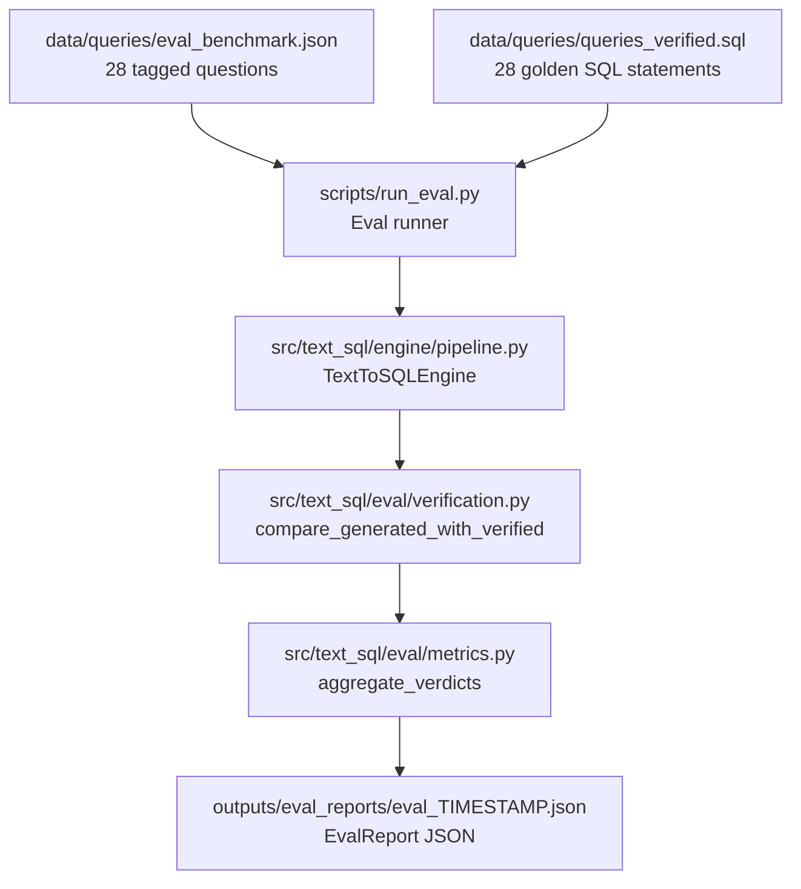
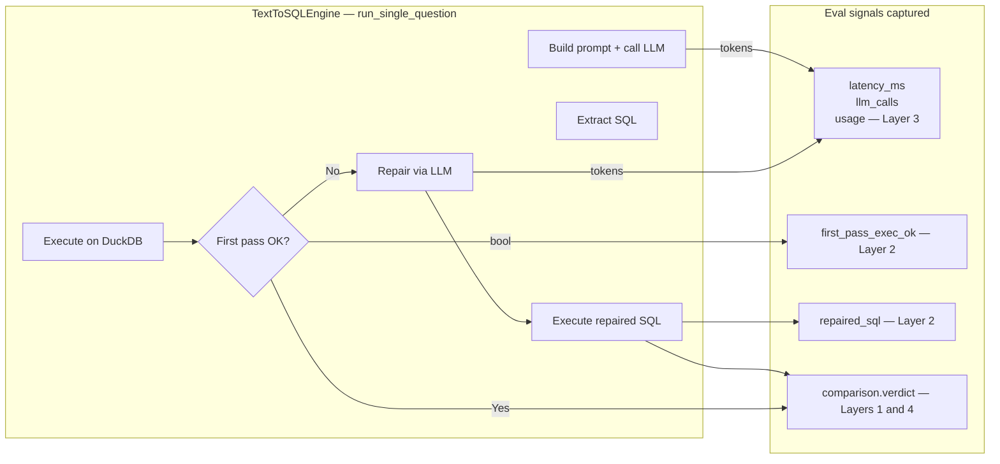

# Eval.md — Evaluation Framework for the NL→SQL Pipeline

**Companion:** [`Codebase.md`](Codebase.md) covers the overall repository layout. [`ProjectStatus.md`](ProjectStatus.md) covers the ML framing and current state. **This document** is the technical reference for how the NL→SQL pipeline is evaluated — what is measured, where the code lives, and how to run it.

---

## 1. Overview

The evaluation framework answers one core question: **how reliably does the LLM-generated SQL return the correct answer for a given natural-language question about the nutrition dataset?**

It is structured as four independent layers, each measuring a different property of the pipeline. All layers are computed in a single run of `scripts/run_eval.py` and recorded in a structured JSON report.



---

## 2. Data Files

### `data/queries/queries.txt`
One natural-language question per line. The 28 curated questions covering the full breadth of analytics use cases for the nutrition dataset. Used as the fallback question source when running without category tags.

### `data/queries/queries_verified.sql`
Hand-verified SQL for each of the 28 questions, annotated with `-- Q<N>:` headers so the parser can look up the correct statement by query index. Each statement has been executed against the reference database and the result is stored in a comment alongside it. This is the **ground truth** against which generated SQL is compared.

### `data/queries/eval_benchmark.json`
A JSON array, one object per question, that adds **category tags** to the plain text list. Each entry has:

| Field | Type | Description |
|-------|------|-------------|
| `query_index` | int | 1-indexed, matches `Q<N>` in `queries_verified.sql` |
| `question` | str | Natural-language question (verbatim from `queries.txt`) |
| `category` | str | Question type (see taxonomy below) |
| `notes` | str | Notes on what SQL pattern is expected |

**Category taxonomy** (7 types across the 28 questions):

| Category | What it tests | Example |
|----------|--------------|---------|
| `prevalence` | Single or multi-month `AVG(CASE WHEN indicator=1)*100` | "What % of children were underweight in Feb?" |
| `trend` | Feb→Mar or Mar→Apr status transitions; adjacent-column conjunction | "What % moved from moderately_underweight to normal?" |
| `ranking` | `GROUP BY district/project/awc ORDER BY metric DESC LIMIT N` | "Which 10 districts have the highest stunting rate?" |
| `demographic_filter` | Subgroup filters on gender, birth_weight, age | "Among low birth weight children, what % are wasted?" |
| `data_quality` | Completeness checks on height/weight/date columns | "What % have missing Feb height or weight?" |
| `count` | `COUNT(*)` or `COUNT DISTINCT`, not percentage | "How many children are active in all three months?" |
| `multi_axis` | Conjunction across stunting + underweight + wasting indicators | "What % are normal on all three axes in April?" |

---

## 3. Evaluation Layers

### Layer 1 — Execution Accuracy

**Purpose:** The primary correctness signal. Answers the question: *did the generated SQL return the same rows and values as the hand-verified SQL?*

**How it works:**
1. The runner executes the generated SQL against the live DuckDB.
2. It also executes the verified SQL from `queries_verified.sql` against the same database.
3. `compare_generated_with_verified()` recursively compares the result structures with numeric tolerance (`abs_tol=1e-9`, `rel_tol=1e-9`). Row order is normalized by `sorted(..., key=repr)`.
4. Each query receives a verdict: `right`, `wrong`, or `not_checked` (when verified SQL is absent or itself fails).

**Metrics:**

| Metric | Formula |
|--------|---------|
| `execution_accuracy` | `right / (right + wrong)` over all checked queries |
| `not_checked_rate` | `not_checked / total` — lower is better; indicates benchmark gaps |

**Code:**
- Core comparison logic: [`src/text_sql/eval/verification.py`](../src/text_sql/eval/verification.py) — `compare_generated_with_verified()`, `compare_structured_values()`
- Aggregation: [`src/text_sql/eval/metrics.py`](../src/text_sql/eval/metrics.py) — Layer 1 counters inside `aggregate_verdicts()`

---

### Layer 2 — Reliability

**Purpose:** Diagnoses *where in the pipeline failures occur* and measures how much the self-repair loop helps. Separates "SQL was wrong by content" from "SQL never executed at all."

**How it works:**
The pipeline now tracks `first_pass_exec_ok` — a boolean set before any repair attempt. This field is available in the trace dict returned by `run_single_question()`. The runner uses this together with `repaired_sql is not None` to attribute each query to one of:
- Clean success (first pass executed and was correct)
- Repair triggered + succeeded
- Repair triggered + still wrong
- First pass failed + no repair attempted

**Metrics:**

| Metric | Formula |
|--------|---------|
| `first_pass_exec_rate` | % of queries where the first SQL executed without a database error |
| `repair_rate` | % of queries that triggered a repair attempt (first pass failed + `repair_enabled=true`) |
| `repair_success_rate` | % of repaired queries that ended up `right` after repair |
| `total_failure_rate` | `wrong / total` — net failure rate after repair |

**Code:**
- `first_pass_exec_ok` flag: [`src/text_sql/engine/pipeline.py`](../src/text_sql/engine/pipeline.py) — stored before the repair branch
- Aggregation: [`src/text_sql/eval/metrics.py`](../src/text_sql/eval/metrics.py) — Layer 2 counters; handles three inference cases (explicit flag / repair implies failure / no repair means first pass = final)

---

### Layer 3 — Cost and Latency

**Purpose:** Tracks the wall-clock time and OpenAI token spend per question. Identifies expensive queries and whether repair disproportionately inflates cost.

**How it works:**
`run_single_question()` wraps the full LLM+execution loop with `time.perf_counter()`. Token counts come from `complete_tracked()`, a new method on `LangChainOpenAIChatClient` that reads `AIMessage.usage_metadata` (LangChain ≥ 0.2) or falls back to `response_metadata["token_usage"]`. When a repair call is made, token counts from both calls are summed.

**Metrics:**

| Metric | Description |
|--------|-------------|
| `avg_latency_ms` | Mean wall-clock time across all queries (ms) |
| `p95_latency_ms` | 95th-percentile latency — flags slow outliers |
| `total_prompt_tokens` | Sum of input tokens across all queries (including repair calls) |
| `total_completion_tokens` | Sum of output tokens |
| `total_tokens` | Combined total |
| `avg_llm_calls_per_query` | 1.0 = all clean; 2.0 = every query needed repair |

**Code:**
- Timing and token capture: [`src/text_sql/engine/pipeline.py`](../src/text_sql/engine/pipeline.py)
- Token extraction from LangChain response: [`src/text_sql/adapters/providers.py`](../src/text_sql/adapters/providers.py) — `LangChainOpenAIChatClient.complete_tracked()`
- Aggregation: [`src/text_sql/eval/metrics.py`](../src/text_sql/eval/metrics.py) — Layer 3 accumulators

---

### Layer 4 — Benchmark Coverage / Taxonomy

**Purpose:** Turns a single pass/fail rate into a **per-category breakdown**, so failures can be attributed to specific question types. A high failure rate on `trend` questions points to a different root cause than failures on `ranking` questions.

**How it works:**
The runner loads `data/queries/eval_benchmark.json`, which tags each of the 28 questions with a category. After each query runs, the category is injected into the result dict as `entry["category"]`. `aggregate_verdicts()` groups verdicts by category and computes per-category accuracy.

**Metrics (per category):**

| Field | Description |
|-------|-------------|
| `n` | Number of questions in this category |
| `right` / `wrong` / `not_checked` | Per-verdict counts |
| `accuracy` | `right / (right + wrong)` for that category |

**Code:**
- Category source: [`data/queries/eval_benchmark.json`](../data/queries/eval_benchmark.json)
- Category injection: [`scripts/run_eval.py`](../scripts/run_eval.py) — line `entry["category"] = benchmark_by_index[i].get("category")`
- Aggregation: [`src/text_sql/eval/metrics.py`](../src/text_sql/eval/metrics.py) — `CategoryStats` dataclass + Layer 4 section in `aggregate_verdicts()`

---

## 4. Key Code Modules

| File | Role |
|------|------|
| [`src/text_sql/eval/verification.py`](../src/text_sql/eval/verification.py) | Core correctness engine: parses `queries_verified.sql`, executes both SQLs, compares results recursively with numeric tolerance |
| [`src/text_sql/eval/metrics.py`](../src/text_sql/eval/metrics.py) | `EvalReport` dataclass + `aggregate_verdicts()`: turns a list of per-query trace dicts into all four layers of metrics |
| [`src/text_sql/eval/__init__.py`](../src/text_sql/eval/__init__.py) | Re-exports `EvalReport`, `aggregate_verdicts`, `compare_generated_with_verified`, `parse_verified_sql_by_query` |
| [`src/text_sql/engine/pipeline.py`](../src/text_sql/engine/pipeline.py) | `TextToSQLEngine.run_single_question()` — now returns `latency_ms`, `llm_calls`, `usage`, `first_pass_exec_ok` alongside existing fields |
| [`src/text_sql/adapters/providers.py`](../src/text_sql/adapters/providers.py) | `LangChainOpenAIChatClient.complete_tracked()` — returns `(content, usage_dict)` with token counts from the LangChain response |
| [`scripts/run_eval.py`](../scripts/run_eval.py) | CLI eval runner: orchestrates everything end-to-end and writes the `EvalReport` JSON |
| [`data/queries/eval_benchmark.json`](../data/queries/eval_benchmark.json) | 28 questions tagged by category with notes on expected SQL pattern |
| [`data/queries/queries_verified.sql`](../data/queries/queries_verified.sql) | Golden SQL statements (ground truth) with pre-computed results in comments |

---

## 5. Running the Evaluation

### Default run (uses `eval_benchmark.json` + config defaults)
```bash
python scripts/run_eval.py
```

### Override database or model
```bash
python scripts/run_eval.py \
  --db database/nutrition_data.duckdb \
  --model gpt-4o \
  --temperature 0.0
```

### Run without category tags (falls back to `queries.txt`)
```bash
python scripts/run_eval.py --no-benchmark-tags
```

### All CLI options

| Flag | Default | Description |
|------|---------|-------------|
| `--benchmark-file` | `data/queries/eval_benchmark.json` | Tagged benchmark JSON |
| `--no-benchmark-tags` | off | Use plain `queries.txt`, skip category tagging |
| `--queries-file` | from config | Override question source |
| `--verified-sql-file` | from config | Override golden SQL file |
| `--db` | from config | DuckDB file path |
| `--model` | from config / env | OpenAI-compatible model name |
| `--temperature` | from config | LLM sampling temperature |
| `--top-k` | `5` | Max rows hint passed to prompt |
| `--output-dir` | `outputs/eval_reports` | Where to write the JSON report |
| `--config` | `configs/nutrition_text_to_sql.yaml` | YAML config override |

---

## 6. Output Format

Two files are written on every run:

- `outputs/eval_reports/eval_<YYYYMMDD_HHMMSS>.json` — timestamped archive
- `outputs/eval_reports/eval_latest.json` — always the most recent run

### Report structure

```jsonc
{
  "generated_at": "2026-05-20T21:30:00",
  "model": "gpt-5-mini",
  "db_path": "/path/to/nutrition_data.duckdb",
  "total_queries": 28,

  // Layer 1 — Execution Accuracy
  "execution_accuracy": 0.857,
  "not_checked_rate": 0.036,

  // Layer 2 — Reliability
  "first_pass_exec_rate": 0.929,
  "repair_rate": 0.107,
  "repair_success_rate": 0.667,
  "total_failure_rate": 0.143,

  // Layer 3 — Cost & Latency
  "avg_latency_ms": 1840,
  "p95_latency_ms": 3200,
  "total_prompt_tokens": 124000,
  "total_completion_tokens": 18000,
  "total_tokens": 142000,
  "avg_llm_calls_per_query": 1.11,

  // Layer 4 — Per-category
  "per_category": {
    "count":             { "n": 2, "right": 2, "wrong": 0, "not_checked": 0, "accuracy": 1.0  },
    "data_quality":      { "n": 3, "right": 3, "wrong": 0, "not_checked": 0, "accuracy": 1.0  },
    "demographic_filter":{ "n": 4, "right": 4, "wrong": 0, "not_checked": 0, "accuracy": 1.0  },
    "multi_axis":        { "n": 2, "right": 2, "wrong": 0, "not_checked": 0, "accuracy": 1.0  },
    "prevalence":        { "n": 6, "right": 5, "wrong": 1, "not_checked": 0, "accuracy": 0.83 },
    "ranking":           { "n": 5, "right": 4, "wrong": 1, "not_checked": 0, "accuracy": 0.80 },
    "trend":             { "n": 6, "right": 3, "wrong": 2, "not_checked": 1, "accuracy": 0.60 }
  },

  // Per-query detail
  "per_query": [
    {
      "question": "What percentage of children were underweight in February 2024?",
      "query_index": 1,
      "category": "prevalence",
      "verdict": "right",
      "repaired": false,
      "latency_ms": 1423,
      "llm_calls": 1,
      "prompt_tokens": 4200,
      "completion_tokens": 62
    }
    // ... one entry per query
  ],

  // Full raw traces (excluding llm_input to keep file size manageable)
  "raw_results": [...]
}
```

---

## 7. How the Layers Connect to the Pipeline

The diagram below shows which pipeline component each layer observes:


