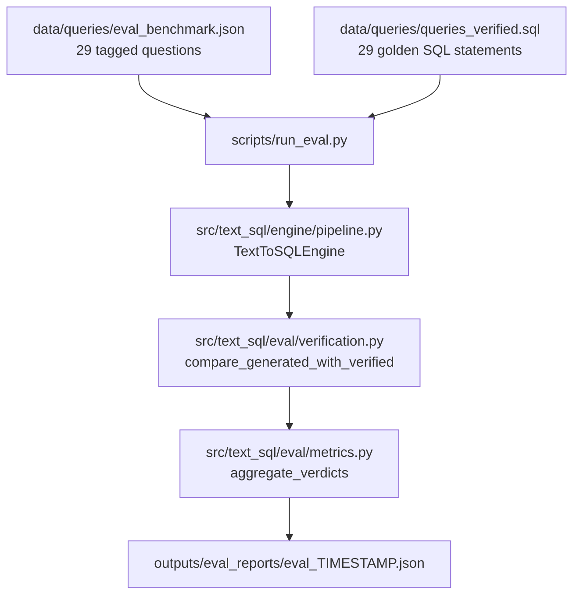
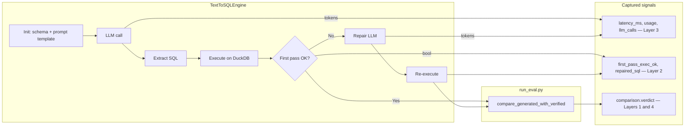

# Eval.md — Evaluation Framework for the NL→SQL Pipeline

**Companion:** [`Codebase.md`](Codebase.md) covers the overall repository layout. [`ProjectStatus.md`](ProjectStatus.md) covers the ML framing and current state. **This document** is the technical reference for how the NL→SQL pipeline is evaluated — what is measured, where the code lives, and how to run it.

Eval always runs the **LLM pipeline** (`TextToSQLEngine`). It does not use the Gradio semantic query cache.

---

## 1. Overview

The evaluation framework answers one core question: **how reliably does the LLM-generated SQL return the correct answer for a given natural-language question about the nutrition dataset?**

Four independent layers are computed in a single run of `scripts/run_eval.py` and written to a JSON report.



---

## 2. Data Files

### `data/queries/queries.txt`
One natural-language question per line (29 curated questions). Fallback question source when running without category tags.

### `data/queries/queries_verified.sql`
Hand-verified SQL for each question, annotated with `-- Q<N>:` headers. Expected results are stored in comments. This is **ground truth** for comparison.

### `data/queries/eval_benchmark.json`
JSON array tagging each question with `query_index`, `question`, `category`, and `notes`.

**Category taxonomy** (7 types):

| Category | What it tests |
|----------|--------------|
| `prevalence` | Single or multi-month percentage indicators |
| `trend` | Month-to-month status transitions |
| `ranking` | `GROUP BY` + `ORDER BY` + `LIMIT` |
| `demographic_filter` | Subgroup filters (gender, birth weight, age) |
| `data_quality` | Completeness on height/weight/date columns |
| `count` | `COUNT(*)` / `COUNT DISTINCT`, not percentages |
| `multi_axis` | Joint stunting + underweight + wasting conditions |

---

## 3. Evaluation Layers

### Layer 1 — Execution Accuracy

**Purpose:** Did generated SQL return the same data as golden SQL?

**How it works:**
1. `TextToSQLEngine` generates and executes SQL.
2. The runner calls `compare_generated_with_verified()` with the pipeline output and golden SQL for that query index.
3. Both result sets are compared recursively with numeric tolerance (defaults from YAML: `1e-9` abs/rel). Row order is normalized.
4. Verdict per query: `right`, `wrong`, or `not_checked`.

| Metric | Formula |
|--------|---------|
| `execution_accuracy` | `right / (right + wrong)` |
| `not_checked_rate` | `not_checked / total` |

**Code:** `src/text_sql/eval/verification.py`, Layer 1 counters in `aggregate_verdicts()`.

---

### Layer 2 — Reliability

**Purpose:** Where do failures occur, and does self-repair help?

The pipeline sets `first_pass_exec_ok` before any repair. The runner combines this with `repaired_sql is not None` to measure first-pass execution, repair rate, and repair success.

| Metric | Formula |
|--------|---------|
| `first_pass_exec_rate` | % first SQL executed without DB error |
| `repair_rate` | % that triggered repair |
| `repair_success_rate` | % of repaired queries that ended `right` |
| `total_failure_rate` | `wrong / total` |

**Code:** `first_pass_exec_ok` in `src/text_sql/engine/pipeline.py`; aggregation in `src/text_sql/eval/metrics.py`.

---

### Layer 3 — Cost and Latency

**Purpose:** Wall-clock time and token spend per question.

`run_single_question()` times the full loop. Tokens come from `LangChainOpenAIChatClient.complete_tracked()`; repair calls add to the same totals.

| Metric | Description |
|--------|-------------|
| `avg_latency_ms` / `p95_latency_ms` | Mean and 95th-percentile latency |
| `total_prompt_tokens` / `total_completion_tokens` / `total_tokens` | Summed across all queries |
| `avg_llm_calls_per_query` | 1.0 = no repairs; 2.0 = every query repaired |

**Code:** `src/text_sql/engine/pipeline.py`, `src/text_sql/adapters/providers.py`, `src/text_sql/eval/metrics.py`.

---

### Layer 4 — Per-Category Breakdown

**Purpose:** Pass/fail rates by question type from `eval_benchmark.json`.

The runner injects `category` into each result dict; `aggregate_verdicts()` groups by category.

| Field | Description |
|-------|-------------|
| `n` | Questions in category |
| `right` / `wrong` / `not_checked` | Counts |
| `accuracy` | `right / (right + wrong)` for that category |

**Code:** category injection in `scripts/run_eval.py`; `CategoryStats` in `src/text_sql/eval/metrics.py`.

---

## 4. Key Code Modules

| File | Role |
|------|------|
| [`scripts/run_eval.py`](../scripts/run_eval.py) | CLI: load benchmark, create one `TextToSQLEngine`, loop questions, compare to golden SQL, aggregate, write JSON |
| [`src/text_sql/engine/pipeline.py`](../src/text_sql/engine/pipeline.py) | `TextToSQLEngine` — prompt built at init; per-question LLM → extract → execute → optional repair |
| [`src/text_sql/utils/utils.py`](../src/text_sql/utils/utils.py) | YAML settings, prompt template fill, schema/sample grounding |
| [`src/text_sql/eval/verification.py`](../src/text_sql/eval/verification.py) | Parse golden SQL, execute both sides, semantic result comparison |
| [`src/text_sql/eval/metrics.py`](../src/text_sql/eval/metrics.py) | `EvalReport` + `aggregate_verdicts()` for all four layers |
| [`src/text_sql/adapters/providers.py`](../src/text_sql/adapters/providers.py) | LLM client with token tracking |

Golden comparison happens **in the eval runner**, not inside `TextToSQLEngine`. The engine returns a placeholder `comparison` dict; the runner overwrites it after calling `compare_generated_with_verified()`.

---

## 5. Running the Evaluation

```bash
python scripts/run_eval.py
```

```bash
python scripts/run_eval.py --db database/nutrition_data.duckdb
python scripts/run_eval.py --no-benchmark-tags
```

| Flag | Default | Description |
|------|---------|-------------|
| `--benchmark-file` | `data/queries/eval_benchmark.json` | Tagged benchmark JSON |
| `--no-benchmark-tags` | off | Use `queries.txt`, skip categories |
| `--queries-file` | from config | Override plain question file |
| `--verified-sql-file` | from config | Override golden SQL file |
| `--db` | from config | DuckDB path |
| `--top-k` | `5` | Row hint for prompt template |
| `--output-dir` | `outputs/eval_reports` | Report output directory |
| `--config` | `configs/nutrition_text_to_sql.yaml` | Engine config |

Model and temperature are taken from YAML / env (`MODEL_NAME`, `TEMPERATURE`), not from CLI flags. One engine instance is reused for all questions in a run.

---

## 6. Output Format

Writes two files per run:

- `outputs/eval_reports/eval_<YYYYMMDD_HHMMSS>.json`
- `outputs/eval_reports/eval_latest.json`

### Top-level fields

| Field | Description |
|-------|-------------|
| `generated_at` | ISO timestamp of the run |
| `model` | LLM model from config / env |
| `db_path` | DuckDB file used |
| `total_queries` | Number of questions evaluated |
| Layer 1 | `execution_accuracy`, `not_checked_rate` |
| Layer 2 | `first_pass_exec_rate`, `repair_rate`, `repair_success_rate`, `total_failure_rate` |
| Layer 3 | `avg_latency_ms`, `p95_latency_ms`, token totals, `avg_llm_calls_per_query` |
| Layer 4 | `per_category` — accuracy breakdown by question type |
| `per_query` | One summary row per question |
| `raw_results` | Full per-query traces (see below) |

`repair_success_rate` is `null` when no queries triggered repair. Token fields may be `0` if the LangChain response does not expose usage metadata for the model in use.

### Latest run snapshot

From [`outputs/eval_reports/eval_latest.json`](../outputs/eval_reports/eval_latest.json) (2026-05-25, `gpt-5-mini`, `nutrition_data_filtered.duckdb`, 29 queries):

| Metric | Value |
|--------|-------|
| `execution_accuracy` | 96.6% (28 / 29) |
| `not_checked_rate` | 0% |
| `first_pass_exec_rate` | 100% |
| `repair_rate` | 0% |
| `total_failure_rate` | 3.4% (1 wrong) |
| `avg_latency_ms` | ~9.8 s |
| `p95_latency_ms` | ~13.8 s |
| `avg_llm_calls_per_query` | 1.0 |

**Per-category:** all categories at 100% except `ranking` (5/6, 83.3%). The single failure was Q21 (`ranking`) — model returned an extra `awc_code` column, so comparison reported `shape_match: false` despite matching counts for the top AWCs.

### `per_query` entry

Compact summary for each question:

```json
{
  "question": "What percentage of children were underweight in February 2024?",
  "query_index": 1,
  "category": "prevalence",
  "verdict": "right",
  "repaired": false,
  "latency_ms": 10886.0,
  "llm_calls": 1,
  "prompt_tokens": 0,
  "completion_tokens": 0
}
```

### `raw_results` entry

Full trace for debugging (omits `llm_input` to keep file size down):

| Field | Description |
|-------|-------------|
| `llm_raw_output` | Raw LLM response text |
| `generated_sql` / `generated_sql_list` | Extracted SQL (final SQL after repair if applicable) |
| `repaired_sql` / `repair_llm_output` | Set when repair ran, else `null` |
| `sql_execution` | `{ok, raw_output, error}` from DuckDB |
| `comparison` | Verdict and diff detail from `compare_generated_with_verified()` |
| `first_pass_exec_ok`, `latency_ms`, `llm_calls`, `usage` | Pipeline instrumentation |
| `category` | From benchmark JSON when tags are enabled |

The `comparison` object is the main place to diagnose failures:

```json
{
  "checked": true,
  "verdict": "right",
  "reason": "Matches verified output",
  "exact_sql_match": false,
  "same_result": true,
  "shape_match": true,
  "max_numeric_diff": 0.0,
  "tolerance_used": {"abs": 1e-09, "rel": 1e-09},
  "generated_results": [...],
  "verified_results": [...]
}
```

`exact_sql_match` compares normalized SQL text; `same_result` compares executed output. A query can be `right` with `exact_sql_match: false` when the SQL differs but returns the same answer.

---

## 7. How the Layers Connect to the Pipeline


