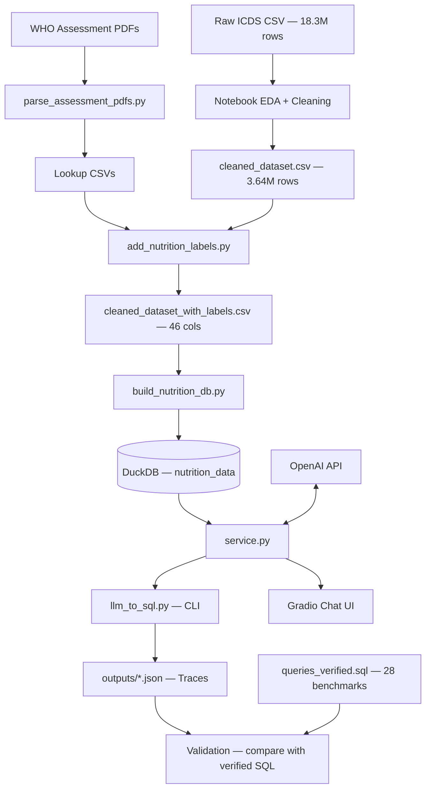
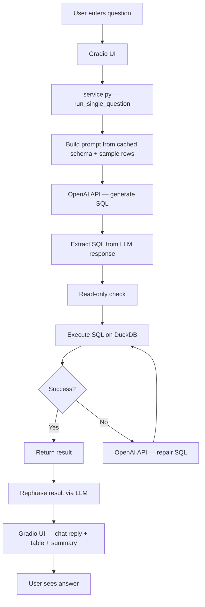

# ProjectStatus.md — Pipeline, Schema & Text-to-SQL

**Companion:** [`README.md`](../README.md) covers environment setup and shell commands. **This document** is the technical reference for **data layout, supervision signals, prompting, model roles, and evaluation** of the LLM-to-SQL stack (ML / analytics-heavy; not a deployment or DevOps checklist).

## 1. Core Mission

**Problem:** Uttar Pradesh's ICDS (Integrated Child Development Services) programme generates millions of child health records monthly, but field workers and programme managers lack the ability to query this data with natural language to extract actionable nutrition insights (prevalence of stunting, SAM, wasting trends, district-level comparisons, etc.).

**Solution:** This project builds an end-to-end pipeline that:
1. Ingests raw child health measurement records (~18.3M rows across 3 months).
2. Classifies each child's nutritional status using WHO-standard anthropometric thresholds.
3. Loads the labeled data into an embedded analytics database (DuckDB).
4. Enables natural-language querying via LLM-generated SQL with a self-repair loop.
5. Presents results through a Gradio chat UI with result rephrasing and tabular display.

**Domain:** Public health nutrition analytics — specifically child malnutrition indicators (stunting, underweight, wasting, SAM/MAM) for children aged 0–6 years in Uttar Pradesh, India, over Feb–Apr 2024.

---

## 2. The Pipeline

### 2.1 End-to-End Flow Diagram



### 2.2 Stage Details

#### Stage 0 — Reference Data Extraction
- **Script:** `scripts/parse_assessment_pdfs.py`
- **Input:** 3 WHO-style assessment parameter PDFs (not committed to repo)
- **Process:** `PyPDF2` text extraction → regex parsing → CSV output
- **Output:** `data/processed/stunting_lookup.csv`, `underweight_lookup.csv`, `wasting_lookup.csv`
- **Idempotent:** Yes. Safe to re-run; overwrites existing CSVs.

#### Stage 1 — Data Cleaning
- **Tool:** `notebooks/01_initial_exploration.ipynb` (manual/interactive)
- **Input:** Raw ICDS CSV (~18.3M rows, 2.3–2.9 GB)
- **Process:** Chunked profiling (20k-row chunks), Hb column removal, null birth metrics filtering
- **Output:** `data/cleaned_dataset.csv` (~3.64M rows, ~80% reduction)
- **Status:** ⚠️ Not automated — requires manual notebook execution.

#### Stage 2 — Nutrition Labeling
- **Script:** `scripts/add_nutrition_labels.py`
- **Input:** Cleaned CSV + lookup tables (from Stage 0)
- **Process:** Streams in 50k-row chunks. For each row and each month (`feb24`, `mar24`, `apr24`), calls `classify_all()` from `src/nutrition_labels.py`. Drops rows with zero height/weight.
- **Output:** `data/cleaned_dataset_with_labels.csv` (~3.64M rows, 46 columns)
- **Runtime:** Significant — row-by-row classification over 3.6M × 3 months.

#### Stage 3 — Database Build
- **Script:** `scripts/build_nutrition_db.py`
- **Input:** Labeled CSV
- **Process:** Full CSV → pandas DataFrame → normalize `*_is_*` columns to 0/1 → `CREATE OR REPLACE TABLE` in DuckDB
- **Output:** User-selected path (Gradio default: `database/nutrition_data_filtered.duckdb`; full export often `database/nutrition_data.duckdb`)
- **Note:** Loads entire CSV into memory. For the 3.6M-row dataset this requires ~4–8 GB RAM.

#### Stage 4 — LLM-to-SQL Query
- **Service:** `src/nutrition_sql/service.py`
- **Process:**
  1. Cache schema introspection + 3 sample rows from DuckDB
  2. Build grounded prompt with business rules and SQL patterns
  3. Invoke `ChatOpenAI` (model: `gpt-5-mini`, temp: 0.0)
  4. Extract SQL from LLM response (handles fenced/unfenced output)
  5. Enforce read-only (SELECT/WITH only)
  6. Execute via LangChain `SQLDatabase`
  7. On failure: one repair attempt via second LLM call
  8. Return structured result dict

- **Interfaces:**
  - **CLI:** `scripts/llm_to_sql.py` (single question or batch from file)
  - **Web:** `apps/gradio_app.py` (Gradio chat with result rephrasing)

#### Stage 5 — Validation
- **Benchmark:** 28 curated questions in `data/queries/queries.txt`
- **Golden SQL:** `data/queries/queries_verified.sql` with expected results in comments
- **Comparison:** `compare_generated_with_verified()` performs structural + numeric diff with configurable tolerance
- **Output:** Per-query verdicts (`right`/`wrong`/`not_checked`) in trace JSON

### 2.3 ML-oriented view of the same pipeline

The stack is best read as **deterministic feature and label construction** followed by **constrained program synthesis** over a frozen warehouse:

| Stage | ML framing |
|-------|------------|
| **PDF → lookups** | Curating a **closed-world threshold library** (height/weight/age-dependent decision boundaries). This is the “teacher” specification, not learned. |
| **Row-wise `classify_all()`** | Rule-based **multi-task labeling**: per month, each child receives categorical status heads (stunting, underweight, wasting) plus binary SAM / indicator columns. Equivalent to applying fixed decision functions in feature space. |
| **DuckDB materialization** | **Materialized view** of the full labeled tensor: one row per child, wide layout over three time indices (`feb24_*`, `mar24_*`, `apr24_*`). No trainable weights; the value is a stable **execution substrate** for downstream querying. |
| **NL → SQL** | **Conditional code generation**: the LM maps natural language to a single DuckDB `SELECT`/`WITH` program subject to schema and domain constraints (see §4). |
| **Repair on error** | **One-step execution-guided refinement**: the engine feeds the failing SQL plus the database error string into the same model family for a second completion—akin to a single rejection sample, not a full search. |
| **Rephrase** | **Separate conditional generation** task: a smaller LM turns structured execution output (JSON preview) into 1–2 sentences under strict **groundedness** rules (see §4.6). |
| **Verified SQL suite** | **Behavioral evaluation**: compares *executed* result tuples (with numeric tolerances), not string equality of SQL—tests semantic alignment to reference analytics. |

---

## 3. DuckDB schema & supervision layout

### 3.1 Grain and panel structure

- **Unit of analysis:** one row per child (`beneficiary_id`).
- **Temporal scope:** three fixed waves encoded as **column prefixes**, not as a normalized time index: `feb24_`, `mar24_`, `apr24_` (February–April 2024).
- **Implication for the LM:** longitudinal questions are expressed as **constraints across columns** (e.g. `feb24_stunting_status` vs `mar24_stunting_status`), not as `GROUP BY month` on a tall table.

### 3.2 Column families (conceptual schema)

| Family | Representative columns | Role in modeling / SQL |
|--------|------------------------|-------------------------|
| **Identity** | `beneficiary_id` | Primary key; defines independent samples for prevalence-style aggregates. |
| **Demographics** | `dob`, `gender`, `birth_height`, `birth_weight` | Static covariates; low birth weight queries use explicit numeric thresholds on `birth_weight`. |
| **Admin / geography** | `state_id`, `district_name`, `project_id`, `sector_id`, `awc_id`, `awc_code` | Categorical hierarchy; default app DB uses **`district_name` (VARCHAR)** after ID→name mapping. Filtering is equality on literal district strings. |
| **Monthly raw** | `{m}_status`, `{m}_height`, `{m}_weight`, `{m}_height_weight_entered_date` | Measurements and administrative status for wave `m` ∈ {`feb24`,`mar24`,`apr24`}. |
| **Monthly derived labels** | `{m}_stunting_status`, `{m}_is_stunted`, `{m}_underweight_status`, `{m}_is_underweight`, `{m}_wasting_status`, `{m}_is_wasted`, `{m}_is_sam` | **Multi-head supervision**: string heads carry ordered severity classes; `*_is_*` heads are Bernoulli-style indicators (stored numerically 0/1) for prevalence-style `AVG(CASE WHEN …)`. |

**Scale (orders of magnitude):** full labeled CSV ≈3.6M rows × ~46 columns; filtered DuckDB default ≈3.45M rows — large enough that **sampling bias in the prompt** (only 3 rows shown to the LM) matters; the model relies heavily on **DDL + explicit enums** in the system prompt.

### 3.3 Label spaces (closed vocabularies)

The generator is instructed to treat these as **categorical literals** (case- and underscore-sensitive):

- **`{m}_underweight_status`:** `normal`, `moderately_underweight`, `severely_underweight`
- **`{m}_stunting_status`:** `normal`, `moderately_stunted`, `severely_stunted`
- **`{m}_wasting_status`:** `normal`, `overweight`, `obese`, `MAM`, `SAM`

**Transition semantics** (longitudinal): “moved from status A to B” is defined as **adjacent-month conjunction** on status columns (Feb→Mar and Mar→Apr only). This is a deliberate **task specification** injected into the prompt to reduce ambiguous interpretations.

### 3.4 Relationship to `nutrition_labels.py`

Lookup CSVs define **piecewise boundaries** in (age, sex, anthropometry) space. The classifier performs **nearest-neighbor / interpolation** where exact lookup keys are missing—still a deterministic map, but with smoothness assumptions analogous to **kernelized** threshold surfaces.

---

## 4. Text-to-SQL: prompts, models, and evaluation

### 4.1 Grounding context (schema + few-row ICL)

Implementation: `_prepare_db_context` / `_cached_prompt_context` in `src/nutrition_sql/service.py`.

1. **`table_info`:** `SQLDatabase.get_table_info(["nutrition_data"])` — DuckDB DDL-style description injected into the system prompt.
2. **`sample_rows_text`:** `SELECT * FROM nutrition_data LIMIT 3` — **literal few-shot rows** (all columns). Braces in string output are escaped so the outer `f"""` prompt does not corrupt template variables.
3. **Caching:** `lru_cache` on resolved `db_path` string so repeated queries reuse the same **prefix** (stable few-shot unless the DB file changes and the process restarts).

This is **retrieval-free** grounding: no vector store; the entire “knowledge” of column names and types is **symbolic** (DDL + samples).

### 4.2 Primary system prompt (`_build_prompt`)

Structured sections:

1. **Task framing:** “expert DuckDB SQL analyst”, single-table restriction (`nutrition_data` only).
2. **Injected blocks:** `{table_info}`, `{sample_rows_text}`.
3. **Domain invariants:** month prefixes; prohibition on inventing months; enumeration of **exact** status string values; `district_name` filtering without joins.
4. **Output contract:** single read-only statement; no markdown fences in model output (parsed downstream).
5. **Numeric / SQL idioms:** `NULLIF` on denominators; `AVG(CASE WHEN indicator = 1 THEN 1 ELSE 0 END) * 100.0` for prevalence to avoid implicit casting pitfalls.
6. **Query-type disambiguation:** count vs percentage; `LIMIT` behavior for “top N districts”; joint “normal on all three axes” semantics; **multi-step transitions** via `UNION ALL` when both Feb→Mar and Mar→Apr are requested.

**Note:** `top_k` is threaded into `_build_prompt` but **not currently interpolated** into the template body—it is reserved API surface (e.g. future retrieval or beam hints).

### 4.3 Primary generator model & decoding

- **Client:** LangChain `ChatOpenAI`.
- **Defaults (Gradio / env):** `MODEL_NAME` → `gpt-5-mini`, `TEMPERATURE` → `0.0` — **low-entropy** completions favoring reproducible SQL.
- **User message pattern:** `f"{prompt}\n\nUser question:\n{question}"` — a single turn; no native multi-turn chat history in the core `run_single_question` path.

### 4.4 SQL extraction (surface-form normalization)

`_extract_sql` prefers ```sql fenced blocks, then generic fenced `select`, then regex from first `SELECT`/`WITH`. This is a **lightweight parser** on top of LM output; failures here are orthogonal to SQL semantics.

### 4.5 Execution-guided repair

On execution failure, `_repair_sql` sends a **minimal second prompt**: broken SQL + error text, instruction to return corrected SQL only. **Single repair attempt** — a trade-off between latency/cost and depth of search (no tree search, no k-best candidates).

### 4.6 Rephrase model (NLG over structured results)

`apps/result_utils.py` → `rephrase_reply`:

- **Model:** `REPHRASE_MODEL_NAME` (default `gpt-4o-mini`), separate temperature / max_tokens / timeout.
- **Input:** User question + JSON payload with truncated tabular preview (bounded rows / string length).
- **Objective:** **Faithful compression** — rules explicitly forbid inventing columns or values; scalar answers limited to short numeric format.

This is a **second-head** architecture: SQL LM optimizes for executable structure; rephrase LM optimizes for **human-readable, hallucination-averse** summaries conditioned on actual execution output.

### 4.7 Evaluation protocol (`compare_generated_with_verified`)

- Parses **golden SQL** from `queries_verified.sql` by query index.
- Executes both generated and verified statements on the same DuckDB file.
- Compares **parsed result structures** with mixed-type recursion; numeric closeness uses **absolute and relative tolerances** (`1e-9` each in code).
- For list outputs, uses **sorted-by-`repr` tuple ordering** to reduce sensitivity to row order when sets are unordered—an explicit **evaluation transform** separate from user-facing ordering.

---

## 5. Current State

### 5.1 Functional (Production-Ready)

| Component | Status | Notes |
|-----------|--------|-------|
| `scripts/parse_assessment_pdfs.py` | ✅ Functional | Produces correct lookup CSVs; idempotent. |
| `scripts/add_nutrition_labels.py` | ✅ Functional | Chunked streaming; handles edge cases (zero metrics, missing DOB). |
| `src/nutrition_labels.py` | ✅ Functional | Complete classification engine with nearest-neighbor interpolation for missing lookup keys. |
| `scripts/build_nutrition_db.py` | ✅ Functional | Clean DuckDB build with bool normalization. |
| `src/nutrition_sql/service.py` | ✅ Functional | Full NL→SQL pipeline with repair loop and benchmarking support. |
| `scripts/llm_to_sql.py` | ✅ Functional | CLI supports single and batch modes with trace output. |
| `apps/gradio_app.py` | ✅ Functional | Chat UI with result tables, rephrasing, and ground-truth reference. |
| `data/queries/queries_verified.sql` | ✅ Complete | 28 benchmark queries (Q1–Q28) with verified results. |

### 5.2 Work-in-Progress / Incomplete

| Component | Status | Evidence |
|-----------|--------|----------|
| **Data cleaning automation** | 🔶 WIP | Cleaning is done in a notebook (`01_initial_exploration.ipynb`) with a `KeyboardInterrupt` in the saved labeling cell. No script equivalent for the cleaning step exists. |
| **Normalized DB schema** | 🔶 Abandoned | `docs/PROJECT.md` describes a multi-table design (`beneficiaries`, `monthly_measurements`, lookup tables). `notebooks/01_explore.ipynb` validates a `child_health.duckdb` with this schema. The current pipeline only builds the flat `nutrition_data` table. |
| **`src/utils.py`** | 🔶 Dead code | Defines `load_csv()` and `summarize()` but is never imported. |
| **`prefer_verified_templates` routing** | 🔶 Disabled | Parameter exists in `run_single_question()` signature but is a documented no-op (`_ = prefer_verified_templates`). Template routing was removed. |
| **`district_mapping.csv` integration** | 🔶 Partial | `database/nutrition_data_filtered.duckdb` (Gradio default) uses `district_name` from this mapping. `build_nutrition_db.py` still loads CSV as-is (`district_id`); re-running the script overwrites the DB unless a mapping step is added. |

### 5.3 ML / modeling gaps (not an ops backlog)

| Gap | Why it matters for the stack |
|-----|-------------------------------|
| **No feedback from user corrections** | SQL repair is **open-loop**; errors are not logged into a dataset for fine-tuning or preference optimization. |
| **Single repair step** | No **beam search** or multi-candidate execution over generated SQL; may underperform on ambiguous questions. |
| **Prompt context omits most rows** | Only 3 sample rows + DDL; **distribution shift** between prompt samples and global aggregates (e.g. rare districts) can drive mistakes despite correct schema text. |
| **No uncertainty or abstention** | The LM never returns calibrated confidence; bad SQL is only caught by execution failure. |
| **Verified suite = fixed 28 tasks** | Good regression signal but **narrow coverage** of the compositional space of analytics questions. |
| **District mapping outside ETL** | Rebuilding DuckDB from CSV **drops** `district_name` unless a post-step is applied — train/serve skew if scripts and hand-migrated DB diverge. |

**Operational / engineering items** (tests, CI, logging, path hygiene) remain important but are intentionally **out of scope** for this ML-focused status doc; track them in issue tickets or `README.md` if needed.

---

## 6. Execution Flow — "How It Runs"

### 6.1 First-Time Setup

```bash
# 1. Environment
conda activate eda                          # or: python -m venv .venv && source .venv/bin/activate
pip install -r requirements.txt

# 2. Create .env with API key
echo "OPENAI_API_KEY=sk-..." > .env

# 3. Place source PDFs in data/ (if lookup CSVs don't exist yet)
#    StuntedAssessmentParameters.pdf
#    UnderweightAssessmentParameters.pdf
#    WastedAssessmentParameters.pdf

# 4. Place cleaned_dataset.csv in data/ (produced via notebook or external process)
```

### 6.2 Pipeline Execution (Sequential)

```bash
# Stage 0: Parse PDFs → lookup CSVs (skip if data/processed/*.csv already exist)
python scripts/parse_assessment_pdfs.py

# Stage 2: Label the cleaned dataset
python scripts/add_nutrition_labels.py \
  --input data/cleaned_dataset.csv \
  --output data/cleaned_dataset_with_labels.csv

# Stage 3: Build DuckDB
python scripts/build_nutrition_db.py \
  --csv data/cleaned_dataset_with_labels.csv \
  --db database/nutrition_data.duckdb

# Stage 4a: CLI query (single)
python scripts/llm_to_sql.py "What is the SAM prevalence in March 2024?"

# Stage 4b: CLI query (batch with verification)
python scripts/llm_to_sql.py \
  --queries-file "data/queries /queries.txt" \
  --output-dir outputs

# Stage 5: Launch Gradio UI
python apps/gradio_app.py
```

### 6.3 Entry Points Summary

| Entry Point | Type | Command |
|-------------|------|---------|
| `scripts/parse_assessment_pdfs.py` | CLI (no args) | `python scripts/parse_assessment_pdfs.py` |
| `scripts/add_nutrition_labels.py` | CLI (argparse) | `python scripts/add_nutrition_labels.py [--input] [--output] [--chunksize]` |
| `scripts/build_nutrition_db.py` | CLI (argparse) | `python scripts/build_nutrition_db.py [--csv] [--db] [--table]` |
| `scripts/llm_to_sql.py` | CLI (argparse) | `python scripts/llm_to_sql.py "question"` or `--queries-file` |
| `apps/gradio_app.py` | Web server | `python apps/gradio_app.py` → `http://127.0.0.1:7860` |

### 6.4 Environment Variables

| Variable | Default | Used By |
|----------|---------|---------|
| `OPENAI_API_KEY` | *(required)* | `service.py`, transitive to all LLM calls |
| `DB_PATH` | `database/nutrition_data_filtered.duckdb` | `gradio_app.py` |
| `MODEL_NAME` | `gpt-5-mini` | `gradio_app.py` |
| `REPHRASE_MODEL_NAME` | `gpt-4o-mini` | `gradio_app.py` |
| `TOP_K` | `5` | `gradio_app.py` |
| `TEMPERATURE` | `0.0` | `gradio_app.py` |
| `GRADIO_SERVER_NAME` | `127.0.0.1` | `gradio_app.py` |
| `GRADIO_SERVER_PORT` | `7860` | `gradio_app.py` |
| `GRADIO_SHARE` | `false` | `gradio_app.py` |
| `SAVE_TRACE` | `true` | `gradio_app.py` |
| `WARMUP_ON_START` | `true` | `gradio_app.py` |
| `GRADIO_QUEUE_CONCURRENCY` | `2` | `gradio_app.py` |
| `GRADIO_QUEUE_MAX_SIZE` | `32` | `gradio_app.py` |
| `GRADIO_SAVE_HISTORY` | `true` | `gradio_app.py` |

### 6.5 Runtime Architecture



---

## 7. File Inventory

| Directory | Tracked Files | Gitignored Content | Role |
|-----------|--------------|-------------------|------|
| `apps/` | 1 | — | Web UI |
| `scripts/` | 4 | — | ETL pipeline |
| `src/` | 5 | — | Core library |
| `data/` | 0 (gitignored) | ~8 CSVs, 2 text/SQL, 3 PDFs | Data assets |
| `database/` | 1 (`.gitkeep`) | `*.duckdb` files | Analytics DB |
| `notebooks/` | 3 | — | EDA |
| `docs/` | 6+ | — | Documentation |
| `outputs/` | 0 (gitignored) | `*.json` traces | LLM traces |
| Root | 3 (`README.md`, `requirements.txt`, `.gitignore`) | `.env` | Config |


## TODO(Suggestions) 
1. Selective Patch from the DB ( Avoid Select * type statements)
2. Add Logging for the Codebase (INFO, ERROR, CRITICAL levels)
  Ex: LLM Generated Query, SQL Results in INFO 
3. Need Sample Queries - Query, SQL, Natural Language Answer (Tonality, Formatting). [>50]


