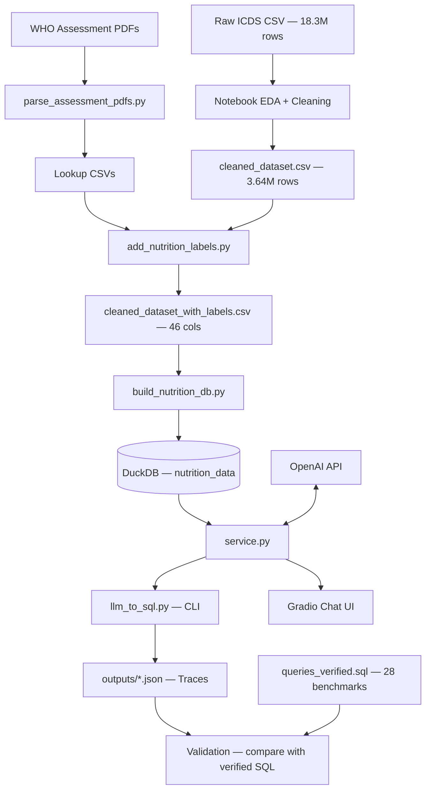
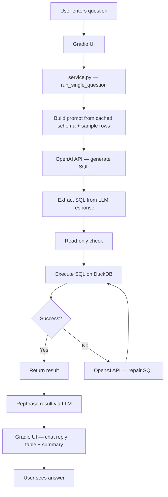

# ProjectStatus.md — Pipeline & Purpose

## 1. Core Mission

**Problem:** Uttar Pradesh's ICDS (Integrated Child Development Services) programme generates millions of child health records monthly, but field workers and programme managers lack the ability to query this data with natural language to extract actionable nutrition insights (prevalence of stunting, SAM, wasting trends, district-level comparisons, etc.).

**Solution:** This project builds an end-to-end pipeline that:
1. Ingests raw child health measurement records (~18.3M rows across 3 months).
2. Classifies each child's nutritional status using WHO-standard anthropometric thresholds.
3. Loads the labeled data into an embedded analytics database (DuckDB).
4. Enables natural-language querying via LLM-generated SQL with a self-repair loop.
5. Presents results through a Gradio chat UI with result rephrasing and tabular display.

**Domain:** Public health nutrition analytics — specifically child malnutrition indicators (stunting, underweight, wasting, SAM/MAM) for children aged 0–6 years in Uttar Pradesh, India, over Feb–Apr 2024.

---

## 2. The Pipeline

### 2.1 End-to-End Flow Diagram



### 2.2 Stage Details

#### Stage 0 — Reference Data Extraction
- **Script:** `scripts/parse_assessment_pdfs.py`
- **Input:** 3 WHO-style assessment parameter PDFs (not committed to repo)
- **Process:** `PyPDF2` text extraction → regex parsing → CSV output
- **Output:** `data/processed/stunting_lookup.csv`, `underweight_lookup.csv`, `wasting_lookup.csv`
- **Idempotent:** Yes. Safe to re-run; overwrites existing CSVs.

#### Stage 1 — Data Cleaning
- **Tool:** `notebooks/01_initial_exploration.ipynb` (manual/interactive)
- **Input:** Raw ICDS CSV (~18.3M rows, 2.3–2.9 GB)
- **Process:** Chunked profiling (20k-row chunks), Hb column removal, null birth metrics filtering
- **Output:** `data/cleaned_dataset.csv` (~3.64M rows, ~80% reduction)
- **Status:** ⚠️ Not automated — requires manual notebook execution.

#### Stage 2 — Nutrition Labeling
- **Script:** `scripts/add_nutrition_labels.py`
- **Input:** Cleaned CSV + lookup tables (from Stage 0)
- **Process:** Streams in 50k-row chunks. For each row and each month (`feb24`, `mar24`, `apr24`), calls `classify_all()` from `src/nutrition_labels.py`. Drops rows with zero height/weight.
- **Output:** `data/cleaned_dataset_with_labels.csv` (~3.64M rows, 46 columns)
- **Runtime:** Significant — row-by-row classification over 3.6M × 3 months.

#### Stage 3 — Database Build
- **Script:** `scripts/build_nutrition_db.py`
- **Input:** Labeled CSV
- **Process:** Full CSV → pandas DataFrame → normalize `*_is_*` columns to 0/1 → `CREATE OR REPLACE TABLE` in DuckDB
- **Output:** `database/nutrition_data.duckdb`
- **Note:** Loads entire CSV into memory. For the 3.6M-row dataset this requires ~4–8 GB RAM.

#### Stage 4 — LLM-to-SQL Query
- **Service:** `src/nutrition_sql/service.py`
- **Process:**
  1. Cache schema introspection + 3 sample rows from DuckDB
  2. Build grounded prompt with business rules and SQL patterns
  3. Invoke `ChatOpenAI` (model: `gpt-5-mini`, temp: 0.0)
  4. Extract SQL from LLM response (handles fenced/unfenced output)
  5. Enforce read-only (SELECT/WITH only)
  6. Execute via LangChain `SQLDatabase`
  7. On failure: one repair attempt via second LLM call
  8. Return structured result dict

- **Interfaces:**
  - **CLI:** `scripts/llm_to_sql.py` (single question or batch from file)
  - **Web:** `apps/gradio_app.py` (Gradio chat with result rephrasing)

#### Stage 5 — Validation
- **Benchmark:** 28 curated questions in `data/queries/queries.txt`
- **Golden SQL:** `data/queries/queries_verified.sql` with expected results in comments
- **Comparison:** `compare_generated_with_verified()` performs structural + numeric diff with configurable tolerance
- **Output:** Per-query verdicts (`right`/`wrong`/`not_checked`) in trace JSON

---

## 3. Current State

### 3.1 Functional (Production-Ready)

| Component | Status | Notes |
|-----------|--------|-------|
| `scripts/parse_assessment_pdfs.py` | ✅ Functional | Produces correct lookup CSVs; idempotent. |
| `scripts/add_nutrition_labels.py` | ✅ Functional | Chunked streaming; handles edge cases (zero metrics, missing DOB). |
| `src/nutrition_labels.py` | ✅ Functional | Complete classification engine with nearest-neighbor interpolation for missing lookup keys. |
| `scripts/build_nutrition_db.py` | ✅ Functional | Clean DuckDB build with bool normalization. |
| `src/nutrition_sql/service.py` | ✅ Functional | Full NL→SQL pipeline with repair loop and benchmarking support. |
| `scripts/llm_to_sql.py` | ✅ Functional | CLI supports single and batch modes with trace output. |
| `apps/gradio_app.py` | ✅ Functional | Chat UI with result tables, rephrasing, and ground-truth reference. |
| `data/queries/queries_verified.sql` | ✅ Complete | 28 benchmark queries (Q1–Q28) with verified results. |

### 3.2 Work-in-Progress / Incomplete

| Component | Status | Evidence |
|-----------|--------|----------|
| **Data cleaning automation** | 🔶 WIP | Cleaning is done in a notebook (`01_initial_exploration.ipynb`) with a `KeyboardInterrupt` in the saved labeling cell. No script equivalent for the cleaning step exists. |
| **Normalized DB schema** | 🔶 Abandoned | `docs/PROJECT.md` describes a multi-table design (`beneficiaries`, `monthly_measurements`, lookup tables). `notebooks/01_explore.ipynb` validates a `child_health.duckdb` with this schema. The current pipeline only builds the flat `nutrition_data` table. |
| **`src/utils.py`** | 🔶 Dead code | Defines `load_csv()` and `summarize()` but is never imported. |
| **`prefer_verified_templates` routing** | 🔶 Disabled | Parameter exists in `run_single_question()` signature but is a documented no-op (`_ = prefer_verified_templates`). Template routing was removed. |
| **`district_mapping.csv` integration** | 🔶 Unused in code | File exists but no script or service code imports or joins it. Some verified SQL references `district_name` which would require this mapping. |

### 3.3 Gaps and Missing Pieces

| Gap | Impact | Recommendation |
|-----|--------|----------------|
| **No test suite** | High — regressions are undetectable. | Add pytest tests for `classify_all()`, `_extract_sql()`, `_is_read_only_sql()`, and integration tests for the SQL pipeline. |
| **No CI/CD** | High — no automated quality gates. | Add GitHub Actions for linting, testing, and (optionally) building the DuckDB from a small test CSV. |
| **No containerization** | Medium — environment reproducibility risk. | Add a `Dockerfile` and `docker-compose.yml` for the Gradio app + DuckDB. |
| **No structured logging** | Medium — debugging is limited to `print()`. | Adopt Python `logging` with structured output. |
| **No data validation** | Medium — schema drift is undetected. | Add a validation step (e.g., Great Expectations or a simple assertion script) between labeling and DB build. |
| **No error monitoring** | Low — LLM failures are swallowed silently. | Add error tracking (Sentry, or at minimum file-based error logs). |
| **`tqdm` missing from requirements** | Low — install may fail. | Add `tqdm>=4.0.0` to `requirements.txt`. |
| **Space in `data/queries /` dirname** | Low — fragile. | Rename to `data/queries/` (no trailing space). |

---

## 4. Execution Flow — "How It Runs"

### 4.1 First-Time Setup

```bash
# 1. Environment
conda activate eda                          # or: python -m venv .venv && source .venv/bin/activate
pip install -r requirements.txt

# 2. Create .env with API key
echo "OPENAI_API_KEY=sk-..." > .env

# 3. Place source PDFs in data/ (if lookup CSVs don't exist yet)
#    StuntedAssessmentParameters.pdf
#    UnderweightAssessmentParameters.pdf
#    WastedAssessmentParameters.pdf

# 4. Place cleaned_dataset.csv in data/ (produced via notebook or external process)
```

### 4.2 Pipeline Execution (Sequential)

```bash
# Stage 0: Parse PDFs → lookup CSVs (skip if data/processed/*.csv already exist)
python scripts/parse_assessment_pdfs.py

# Stage 2: Label the cleaned dataset
python scripts/add_nutrition_labels.py \
  --input data/cleaned_dataset.csv \
  --output data/cleaned_dataset_with_labels.csv

# Stage 3: Build DuckDB
python scripts/build_nutrition_db.py \
  --csv data/cleaned_dataset_with_labels.csv \
  --db database/nutrition_data.duckdb

# Stage 4a: CLI query (single)
python scripts/llm_to_sql.py "What is the SAM prevalence in March 2024?"

# Stage 4b: CLI query (batch with verification)
python scripts/llm_to_sql.py \
  --queries-file "data/queries /queries.txt" \
  --output-dir outputs

# Stage 5: Launch Gradio UI
python apps/gradio_app.py
```

### 4.3 Entry Points Summary

| Entry Point | Type | Command |
|-------------|------|---------|
| `scripts/parse_assessment_pdfs.py` | CLI (no args) | `python scripts/parse_assessment_pdfs.py` |
| `scripts/add_nutrition_labels.py` | CLI (argparse) | `python scripts/add_nutrition_labels.py [--input] [--output] [--chunksize]` |
| `scripts/build_nutrition_db.py` | CLI (argparse) | `python scripts/build_nutrition_db.py [--csv] [--db] [--table]` |
| `scripts/llm_to_sql.py` | CLI (argparse) | `python scripts/llm_to_sql.py "question"` or `--queries-file` |
| `apps/gradio_app.py` | Web server | `python apps/gradio_app.py` → `http://127.0.0.1:7860` |

### 4.4 Environment Variables

| Variable | Default | Used By |
|----------|---------|---------|
| `OPENAI_API_KEY` | *(required)* | `service.py`, transitive to all LLM calls |
| `DB_PATH` | `database/nutrition_data.duckdb` | `gradio_app.py` |
| `MODEL_NAME` | `gpt-5-mini` | `gradio_app.py` |
| `REPHRASE_MODEL_NAME` | `gpt-4o-mini` | `gradio_app.py` |
| `TOP_K` | `5` | `gradio_app.py` |
| `TEMPERATURE` | `0.0` | `gradio_app.py` |
| `GRADIO_SERVER_NAME` | `127.0.0.1` | `gradio_app.py` |
| `GRADIO_SERVER_PORT` | `7860` | `gradio_app.py` |
| `GRADIO_SHARE` | `false` | `gradio_app.py` |
| `SAVE_TRACE` | `true` | `gradio_app.py` |
| `WARMUP_ON_START` | `true` | `gradio_app.py` |
| `GRADIO_QUEUE_CONCURRENCY` | `2` | `gradio_app.py` |
| `GRADIO_QUEUE_MAX_SIZE` | `32` | `gradio_app.py` |
| `GRADIO_SAVE_HISTORY` | `true` | `gradio_app.py` |

### 4.5 Runtime Architecture



---

## 5. File Inventory

| Directory | Tracked Files | Gitignored Content | Role |
|-----------|--------------|-------------------|------|
| `apps/` | 1 | — | Web UI |
| `scripts/` | 4 | — | ETL pipeline |
| `src/` | 5 | — | Core library |
| `data/` | 0 (gitignored) | ~8 CSVs, 2 text/SQL, 3 PDFs | Data assets |
| `database/` | 1 (`.gitkeep`) | `*.duckdb` files | Analytics DB |
| `notebooks/` | 3 | — | EDA |
| `docs/` | 6+ | — | Documentation |
| `outputs/` | 0 (gitignored) | `*.json` traces | LLM traces |
| Root | 3 (`README.md`, `requirements.txt`, `.gitignore`) | `.env` | Config |


## TODO(Suggestions) 
1. Selective Patch from the DB ( Avoid Select * type statements)
2. Add Logging for the Codebase (INFO, ERROR, CRITICAL levels)
  Ex: LLM Generated Query, SQL Results in INFO 
3. Need Sample Queries - Query, SQL, Natural Language Answer (Tonality, Formatting). [>50]


