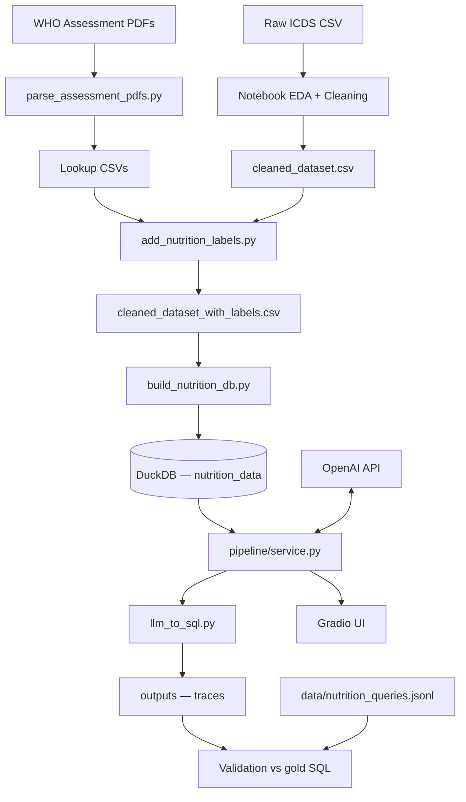
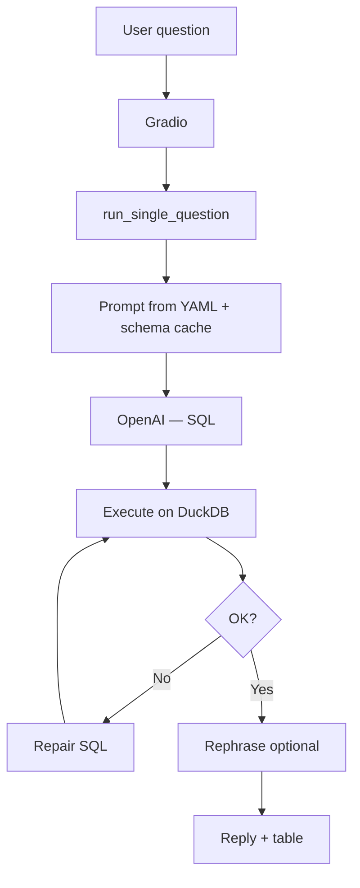

# Project status — purpose and codebase guide

This document summarizes **why the repo exists**, **how data and queries flow through it**, and **what is implemented today**. For file-level detail see [Codebase.md](Codebase.md); for test mapping see [TestSuite.md](TestSuite.md).

---

## Purpose

Uttar Pradesh ICDS child health data is large and tabular; this project turns labeled records into a **DuckDB** file and lets users ask **natural-language questions** that an LLM answers by generating **read-only SQL**, with optional repair on failure and a **Gradio** chat UI. The primary domain is **child nutrition** (stunting, underweight, wasting, SAM/MAM) for 0–6y, Feb–Apr 2024. The same NL→SQL machinery can target **other DuckDB datasets** via Hydra profiles (e.g. BIRD-style benchmarks).

---

## Assumptions

The code is written around the following constraints. They are not universal truths about “any SQL database,” but **what this repository expects** so paths, configs, and tests stay coherent.

**Language, packages, and config**

- **Python 3** with the packages pinned in [`requirements.txt`](../requirements.txt) (no single pinned Python micro-version in-repo). Notable stack pieces: **Hydra** for composed YAML under `conf/`, **LangChain** for LLM + SQLDatabase wiring, **SQLAlchemy** (pinned below 2.x), **duckdb-engine**, **Gradio** for the UI.
- **Hydra** loads `conf/config.yaml` with defaults `dataset`, `llm`, `rephrase`, `gradio`; `hydra.job.chdir` stays **false** so relative paths resolve from the process cwd as intended.
- **Secrets** come from the environment (often a repo-root `.env` loaded by `python-dotenv` where scripts do so); **`OPENAI_API_KEY`** is required for any NL→SQL or rephrase call.

**LLM**

- The implementation uses **`langchain_openai.ChatOpenAI`** — an **OpenAI-compatible HTTP API** with the usual env-based key. Swapping to another provider means changing that wiring, not just env vars.

**Database and SQL execution**

- **DuckDB only** for the NL→SQL runtime: a **local file** (`.duckdb`) turned into a SQLAlchemy URI `duckdb:///<absolute path>` via `DatasetRuntime`. Other engines are out of scope unless you add drivers and URI handling.
- **One active database per process**, selected at startup from the **`dataset`** Hydra profile plus optional **`DB_PATH`** / profile-specific env vars. The Gradio UI does **not** switch databases at runtime.
- **Read-only execution path:** generated SQL is only run if it passes a lightweight check (`is_read_only_sql`): the trimmed statement must start with **`SELECT`** or **`WITH`**. This is a **heuristic**, not a full SQL parser; it blocks obvious `INSERT`/`UPDATE`/DDL but is not a security guarantee against malicious obfuscation.

**Schema, prompts, and gold data**

- **`dataset.schema_tables`** must name tables that **actually exist** in the DuckDB file; they drive LangChain schema introspection and sample rows.
- **Prompts** live in **`conf/prompts/*.yaml`** with a top-level **`template`** string (and optional **`meta`**). Generation and repair use **separate YAML files** per profile when configured.
- **Gold / benchmark queries** use **JSONL (or JSON)** with **BIRD-style fields** (`question_id`, `SQL`, `evidence`, …). A legacy **`-- Qn:`** annotated `.sql` file can still be loaded if configured.
- **`inject_evidence`** on the dataset profile controls whether evidence strings are passed into the model for that catalog.

**Primary nutrition domain**

- The shipped ETL and prompts assume a **single wide table** (e.g. **`nutrition_data`**) in DuckDB, not the older multi-table normalized sketch documented only in historical notes.

---

## End-to-end flow



---

## Data pipeline (ETL)

| Step | Location | Role | Status |
|------|----------|------|--------|
| Reference thresholds from PDFs | `scripts/parse_assessment_pdfs.py` | Writes `data/processed/*_lookup.csv` | Implemented; idempotent |
| Cleaning / filtering | `notebooks/01_initial_exploration.ipynb` | Produces `data/cleaned_dataset.csv` | **Notebook-only** (not a `scripts/` automation) |
| WHO-style labels | `scripts/add_nutrition_labels.py` + `pipeline/nutrition_labels.py` | Chunked labeling; `classify_all()` | Implemented |
| Build embedded DB | `scripts/build_nutrition_db.py` | CSV → DuckDB table (e.g. `nutrition_data`) | Implemented; memory-heavy for full CSV |

The **runtime query path** does not re-run labeling; it only needs the built `.duckdb` file (and NL→SQL config).

---

## NL→SQL runtime and validation

**Query stack:** `pipeline/execution/runner.py` → `pipeline/llm/chains.py` (templates from `conf/prompts/*.yaml`) → `pipeline/db/engine.py` (LangChain `SQLDatabase`, execute, repair). Facade: `pipeline/service.py`.

**Configuration:** [`conf/config.yaml`](../conf/config.yaml) defaults to `dataset: nutrition`. [`conf/dataset/nutrition.yaml`](../conf/dataset/nutrition.yaml) sets `paths.db_path`, `paths.queries_path`, `dataset.schema_tables`, and YAML prompt paths. Switch profile with Hydra, e.g. `dataset=bird`, and env vars such as `DB_PATH`, `QUERIES_PATH`, or `BIRD_DB_PATH` / `BIRD_QUERIES_PATH` as documented in that profile. Dataset shape, DB engine, and prompt-file rules are summarized under **Assumptions** above.

**Validation:** Batch CLI compares generated SQL execution to gold SQL via `compare_generated_with_verified()`; line order in `data/queries/queries.txt` aligns with `question_id` in the catalog. Traces land under `outputs/`.

---

## What exists in the repository

| Area | Contents | Status |
|------|----------|--------|
| **`scripts/`** | PDF parse, labeling, DB build, `llm_to_sql.py` | All four entry points are implemented CLI tools |
| **`pipeline/`** | `nutrition_labels`, `dataset_runtime`, `queries/catalog`, `db/engine`, `llm/` (chains + prompt loader), `execution/`, `benchmark/verification`, `service` | Core library for NL→SQL; used by apps and scripts |
| **`apps/`** | `gradio_app.py`, `result_utils.py`, `ui_content.py`, `config.py` | Gradio UI, formatting, rephrase helpers |
| **`conf/`** | `config.yaml`, `dataset/*.yaml`, `llm`, `rephrase`, `gradio`, `prompts/*.yaml` | Hydra defaults; dataset-specific paths and prompts |
| **`data/`** | CSVs, lookups, `nutrition_queries.jsonl`, legacy `queries/queries_verified.sql` | Assets often gitignored locally; JSONL is the preferred gold-SQL catalog |
| **`database/`** | Built `.duckdb` (often gitignored) | Output of `build_nutrition_db.py` |
| **`tests/`** | Pure helpers, temp DuckDB, Gradio smoke, optional `requires_db` | `PYTHONPATH=. pytest tests/`; see TestSuite.md |
| **`docs/`** | Codebase.md, this file, TestSuite.md | Architecture and test catalog |
| **`notebooks/`** | EDA and exploration | Not part of automated pipeline |

**Historical / unused in the query path:** `docs/PROJECT.md` described a normalized multi-table schema; the shipped pipeline uses a **single wide** `nutrition_data` table. `district_mapping.csv` exists under `data/` but is not wired into scripts or the NL→SQL layer. A `prefer_verified_templates` parameter on `run_single_question` remains as a **no-op** for backward compatibility.

---

## Tests

Pytest covers SQL text helpers, read-only guards, small DuckDB fixtures, path resolution, catalog parsing, benchmark comparison helpers, Gradio `build_app` smoke (mocked LLM), and result/rephrase utilities. Optional connectivity tests against a real DuckDB file use `RUN_CONNECTIVITY=1` and the `requires_db` marker. Details: [TestSuite.md](TestSuite.md).

---

## How to run

### Setup

```bash
pip install -r requirements.txt
# .env at repo root: OPENAI_API_KEY=...
```

### Typical commands

```bash
# ETL (when assets are present)
python scripts/parse_assessment_pdfs.py
python scripts/add_nutrition_labels.py --input data/cleaned_dataset.csv --output data/cleaned_dataset_with_labels.csv
python scripts/build_nutrition_db.py --csv data/cleaned_dataset_with_labels.csv --db database/nutrition_data.duckdb

# NL→SQL
python scripts/llm_to_sql.py "Your question?"
python scripts/llm_to_sql.py --queries-file "data/queries/queries.txt" --output-dir outputs

# Web UI
python apps/gradio_app.py
```

### Entry points

| Script / app | Command |
|--------------|---------|
| `parse_assessment_pdfs.py` | `python scripts/parse_assessment_pdfs.py` |
| `add_nutrition_labels.py` | `python scripts/add_nutrition_labels.py` (see `--help`) |
| `build_nutrition_db.py` | `python scripts/build_nutrition_db.py` (see `--help`) |
| `llm_to_sql.py` | `python scripts/llm_to_sql.py` … or Hydra overrides after args |
| `gradio_app.py` | `python apps/gradio_app.py` → default http://127.0.0.1:7860 |

### Environment variables (common)

| Variable | Role |
|----------|------|
| `OPENAI_API_KEY` | Required for any LLM call |
| `DB_PATH` | Overrides default DuckDB path from dataset config |
| `QUERIES_PATH` | Gold query catalog JSONL |
| `MODEL_NAME`, `TEMPERATURE`, `TOP_K` | LLM overrides for CLI/UI |
| `GRADIO_SERVER_NAME`, `GRADIO_SERVER_PORT`, `GRADIO_SHARE` | Gradio server |
| `BIRD_DB_PATH`, `BIRD_QUERIES_PATH` | Used when `dataset=bird` (see `conf/dataset/bird.yaml`) |

### Runtime sequence (Gradio / single question)



---

## Repository layout (quick reference)

| Path | Role |
|------|------|
| `apps/` | Gradio UI and display helpers |
| `scripts/` | ETL and CLI query |
| `pipeline/` | Shared NL→SQL and nutrition labeling library |
| `conf/` | Hydra config and YAML prompts |
| `data/` | Inputs and query catalogs |
| `database/` | Built DuckDB (artifact) |
| `tests/` | Pytest |
| `docs/` | Documentation |
| `outputs/` | Batch traces (artifact) |
| `notebooks/` | Exploration |

---

## Related reading

- [Codebase.md](Codebase.md) — structural design and component map  
- [README.md](../README.md) — quick start and env hints  
- [TestSuite.md](TestSuite.md) — automated test catalog  
